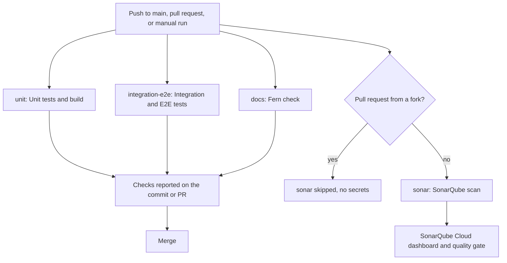

Two things happen to code after it is written: **CI** (GitHub Actions) tests, builds and scans it on every push and pull
request, and **CD** (a manual `npm run deploy`) publishes the frontend to Cloudflare. There is no automatic deploy job today.

| Part | Status |
|---|---|
| CI: unit, integration, e2e, docs check | Automatic, `.github/workflows/ci.yml` |
| SonarQube Cloud scan | Automatic, the `sonar` job in the same workflow |
| Test coverage sent to SonarQube | **Not set up** |
| Deploy of the web app to Cloudflare | **Manual**, `npm run deploy` in `apps/frontend` |
| Deploy of the Express API and Supabase | **Not set up**: both run locally only |

## Pipeline overview



The four jobs are independent: none uses `needs`, so they start together and one failing does not stop the others.
Whether a red check blocks the merge is a branch protection setting in GitHub, which is not stored in the repository.

## The workflow: `.github/workflows/ci.yml`

### Triggers, permissions, concurrency

| Setting | Value | Why |
|---|---|---|
| `on` | `push` to `main`, every `pull_request`, `workflow_dispatch` | Check `main` after a merge, check each PR, allow a manual run from the Actions tab |
| `permissions` | `contents: read` | The workflow only reads the repository |
| `concurrency` | group `ci-${{ github.ref }}`, `cancel-in-progress: true` | A new push to the same branch or PR cancels the older run |

Everything runs against a **local Supabase stack on the runner**, never the cloud project.

### Job `unit`: Unit tests and build

`ubuntu-latest`, 10 minute timeout. Node 24 with the npm cache keyed on both app lockfiles. No Supabase and no `.env.local`
are needed.

| Step | Working directory | Commands |
|---|---|---|
| Frontend unit tests and build | `apps/frontend` | `npm ci`, `npm run test:unit`, `npm run build` |
| Backend typecheck and unit tests | `apps/backend` | `npm ci`, `npm run typecheck`, `npm run test:unit` |

`npm run build` in the frontend is `tsc --noEmit && vite build`, so a type error fails this job. The backend unit tests include
`tests/unit/openapi.test.ts`, which fails when `docs/fern/openapi/openapi.json` is stale (see Troubleshooting).

### Job `integration-e2e`: Integration and E2E tests

`ubuntu-latest`, 30 minute timeout. Node 24 with the npm cache keyed on the frontend, backend and `tests` lockfiles.

| # | Step | Working directory | What it runs |
|---|---|---|---|
| 1 | Install dependencies | repo root | `npm ci --prefix apps/backend`, `npm ci --prefix apps/frontend`, `npm ci --prefix tests` |
| 2 | Supabase CLI | | `supabase/setup-cli@v3`, pinned to version `2.98.1`, the same CLI as local development |
| 3 | Start local Supabase and seed test data (`id: backend`) | `apps/backend` | `supabase start`, `npm run env`, `npm run seed` |
| 4 | Frontend integration tests (stubbed network) | `apps/frontend` | `npm run test:integration` |
| 5 | Backend integration tests | `apps/backend` | `npm run test:integration` (the API over HTTP against local Supabase) |
| 6 | Cross-app integration tests | `tests` | start the API in the background, wait for `/health`, `npm run integration`, stop the API |
| 7 | Install Playwright browser | `tests` | `npx playwright install --with-deps chromium` |
| 8 | E2E tests | `tests` | `npm run e2e` |
| 9 | Upload Playwright report | | `actions/upload-artifact@v7` |

**Why the order matters**

- Step 3 comes first for everything that touches the database. `supabase start` boots the Docker stack. `npm run env` reads
  `supabase status -o env` and writes `apps/frontend/.env.local` and `apps/backend/.env.local` (URL and keys). `npm run seed`
  reads `apps/frontend/.env.local`, so it must run after `npm run env`, and creates the demo accounts and courses the tests expect.
  This is what `task up` does locally.
- Step 6 starts the API with `npm start --prefix ../apps/backend` (log to `api.log` in the repo root), waits for
  `http://localhost:3001/health` (`wait-on`, 60 seconds), runs the cross-app Vitest suite, then `pkill -f "tsx src/main.ts"`.
- The API is stopped before e2e on purpose. In CI the Playwright config sets `reuseExistingServer: false` and starts the API
  (`npm start --prefix ../apps/backend`) and the web app (`npm run dev --prefix ../apps/frontend -- --port 5173 --strictPort`)
  itself through `webServer`; a server left running on port 3001 would make Playwright fail to start.
  Caveat: `pkill` is the last line of the same step, so if the cross-app tests fail the step stops before it and the API stays up.
  Reading the workflow, e2e would then hit the port conflict; the fix is a separate cleanup step with `if: always()` (not done).
- In CI Playwright also retries a failing test twice (`retries: 2`), writes an HTML report and records a trace on the first retry.

**When e2e still runs after a failure.** Steps 7 and 8 have `if: ${{ !cancelled() && steps.backend.outcome == 'success' }}`.
They run even if the integration steps failed, so each suite reports its own result, but only when the Supabase start and
seed (step 3) succeeded, since e2e cannot work without them. Steps 4 to 6 have no `if`, so a failure in step 4 or 5 skips the
steps after it up to step 7 (including the cross-app step), while e2e still runs.

**Playwright report artifact.** Step 9 runs with `if: ${{ !cancelled() }}`, so it uploads on success and on failure. The artifact
is named `playwright-report` and holds `tests/playwright-report/` and `tests/test-results/` (screenshots, traces). Retention is
14 days, and `if-no-files-found: ignore` keeps the step green when e2e never ran. Download it from the run summary page and open
`index.html` or use `npx playwright show-trace`.

### Job `docs`: Docs (Fern check)

`ubuntu-latest`, 10 minute timeout, working directory `docs` for every step: `npm ci`, then `npx fern-api check`. The Fern
config sets `broken-links: error`, so a dead link in a page fails the job. It does not regenerate the OpenAPI spec; that
freshness check is the backend unit test in the `unit` job.

### Job `sonar`: SonarQube scan

`ubuntu-latest`, 10 minute timeout.

```yaml
if: github.event_name != 'pull_request' || github.event.pull_request.head.repo.full_name == github.repository
```

- It runs on pushes to `main`, manual runs and pull requests from branches of this repository.
- **Fork PRs skip it.** GitHub gives fork pull requests no secrets, so `SONAR_TOKEN` is empty and the scan could not sign in.
  The job shows as skipped, not failed.
- Checkout uses `fetch-depth: 0` (full history): SonarQube needs the history to tell new code from old code and to blame lines.
  A shallow clone gives wrong or missing "new code" results.
- The scan is `SonarSource/sonarqube-scan-action@v8` with `SONAR_TOKEN: ${{ secrets.SONAR_TOKEN }}`. It reads
  `sonar-project.properties` from the repository root. It does not build or test anything first.

## SonarQube

SonarQube Cloud (sonarcloud.io) analyses the code and reports bugs, vulnerabilities, code smells, security hotspots and
duplication.

### `sonar-project.properties`

| Property | Value | Meaning |
|---|---|---|
| `sonar.organization` | `tktanawat138-alt` | The SonarQube Cloud organization (the defaults assigned when the repository was imported) |
| `sonar.projectKey` | `tktanawat138-alt_SeatSure` | The project key |
| `sonar.projectName` | `SeatSure` | Display name |
| `sonar.sources` | `apps/frontend/src,apps/backend/src` | Production code that is analysed |
| `sonar.tests` | `apps/frontend/tests,apps/backend/tests,tests` | Test code. Scanned as tests, so it is kept out of the production metrics |
| `sonar.sourceEncoding` | `UTF-8` | Needed for the Thai text in sources |
| `sonar.exclusions` | `apps/backend/src/adaptor/supabase/database.types.ts` | Generated by `task backend:types`, not hand-written |
| `sonar.coverage.exclusions` | `**/*` | Every file is left out of the coverage metric, because no coverage report is uploaded. See "Coverage: not measured" |

What is scanned: frontend and backend source under `src/`. What is not: the SQL migrations in `apps/backend/supabase/`, the
backend `scripts/`, `docs/` and the Taskfile. Tests are listed as tests, and the generated Supabase types are excluded.

### The `SONAR_TOKEN` secret

A SonarQube Cloud token (account, then Security, then generate a token) stored as the repository secret `SONAR_TOKEN`
(GitHub: Settings, Secrets and variables, Actions). Only the `sonar` job reads it. Nothing sets `SONAR_HOST_URL`, so the scan
action uses its SonarQube Cloud default. A missing or expired token makes the job fail at the sign-in step.

### Quality gate: reported, not enforced

The quality gate result appears on SonarQube Cloud, but it does **not** fail the pipeline. The action's
`sonar.qualitygate.wait` option stays at its default, `false`: the scan uploads the analysis and the job finishes without
waiting for the verdict. The default gate ("Sonar way") also requires 80 percent coverage on new code; that condition is
not evaluated while `sonar.coverage.exclusions=**/*` is set, so the gate is decided by the other conditions (reliability,
security, maintainability, duplication, hotspots reviewed).

Turn it on (add `sonar.qualitygate.wait=true` to `sonar-project.properties`, or pass `-Dsonar.qualitygate.wait=true` in the
action `args`) only after coverage is uploaded, or after the project uses a quality gate without a coverage condition. The job
then waits for the result (limit `sonar.qualitygate.timeout`, 300 seconds by default) and goes red when the gate fails. Raise the
job `timeout-minutes` if needed, and make `sonar` a required check to block merges on it.

### Coverage: not measured

No coverage is uploaded today: no test run produces a coverage report and `sonar-project.properties` has no
`sonar.javascript.lcov.reportPaths`. Without a report SonarQube counted every line as uncovered, showed 0 percent, and failed
the quality gate on "coverage on new code" as soon as a change was large enough for the condition to apply (the merge of the
backend API split on 2026-10-10). `sonar.coverage.exclusions=**/*` now keeps all files out of the coverage metric, so the
dashboard shows no coverage figure instead of a false 0 percent and the gate no longer fails for that reason. This hides
nothing that was measured, but it also means the gate does not check coverage at all. To measure it for real
(**not implemented**):

```bash
# 1. add the provider to each app (not installed today)
npm install -D @vitest/coverage-v8 --prefix apps/frontend
npm install -D @vitest/coverage-v8 --prefix apps/backend

# 2. produce lcov, for example in the unit job
cd apps/frontend && npx vitest run tests/unit --coverage --coverage.reporter=lcov   # apps/frontend/coverage/lcov.info
cd apps/backend  && npx vitest run --project unit --coverage --coverage.reporter=lcov # apps/backend/coverage/lcov.info
```

```properties
# 3. sonar-project.properties: add this, and remove sonar.coverage.exclusions=**/* (or narrow it to the files
#    that unit tests are not meant to cover)
sonar.javascript.lcov.reportPaths=apps/frontend/coverage/lcov.info,apps/backend/coverage/lcov.info
```

The `sonar` job then has to run after the tests and see the `coverage/` folders: add `needs: unit` and pass the folders with
`actions/upload-artifact` and `actions/download-artifact`, or run the tests inside the `sonar` job. Check on the first scan that
the file paths in `lcov.info` match the paths under `sonar.sources`; files Sonar cannot match get no coverage.

### How to read a scan result

1. Open the project dashboard: `https://sonarcloud.io/project/overview?id=tktanawat138-alt_SeatSure` (SonarQube Cloud, project
   `SeatSure`).
2. The **main** branch view is the overall state. Pick a pull request in the branch and PR selector to see only the issues it adds.
3. Read the quality gate first (passed or failed, and which condition), then **Issues** (filter by type and severity) and
   **Security Hotspots** (items to review, not always bugs).
4. Each issue links to the exact line with an explanation and how to fix it.
5. Decoration on the pull request (a Sonar comment and a status check) needs the SonarQube Cloud GitHub integration to be
   enabled for the project. That setting lives on SonarQube Cloud and cannot be checked from this repository. The
   `SonarQube scan` job itself always appears as a normal check.

## Local to Cloudflare

### What is deployed

Only the **frontend**: the static Vite build in `apps/frontend/dist/`. `apps/frontend/wrangler.jsonc` describes it:

```jsonc
{
  "name": "seatsure",
  "compatibility_date": "2026-10-09",
  "assets": {
    "directory": "./dist/",
    "not_found_handling": "single-page-application"
  }
}
```

There is no Worker script. Cloudflare serves the files in `dist/` as assets, and any path that is not a file (`/bookings`,
`/receipt/...`) returns `index.html`, so React Router handles it on the client (SPA fallback).

The scripts in `apps/frontend/package.json`:

| Script | Runs | Does |
|---|---|---|
| `npm run build` | `tsc --noEmit && vite build` | Type-checks, then writes the production bundle to `dist/` |
| `npm run deploy` | `npm run build && wrangler deploy` | Builds, then uploads `dist/` to Cloudflare |

### What is not deployed

| Piece | Where it runs |
|---|---|
| Express API (`apps/backend`) | Your machine only. Hosting it is an open roadmap item in the README |
| Supabase (database, Auth, storage) | The local Docker stack only |

A deployed site therefore needs an API that its visitors can reach over HTTPS. Until the API is hosted, the Cloudflare
site cannot sign anyone in: it is a deployable shell. Local development is unaffected.

### Step by step from a local machine

1. **Log in to Cloudflare** (once, opens a browser):

   ```bash
   cd apps/frontend
   npm ci
   npx wrangler login
   npx wrangler whoami        # optional: confirm the account
   ```

2. **Know the API URL.** It must be the public HTTPS URL of the hosted Express API.
3. **Deploy with `VITE_API_URL` set for the build:**

   ```bash
   cd apps/frontend
   VITE_API_URL=https://api.example.com npm run deploy
   ```

   Vite replaces `import.meta.env.VITE_API_URL` while it builds, so the value is fixed in the bundle. Changing it later
   means building and deploying again. Do not put a secret in any `VITE_` variable: the browser can read it.
4. Wrangler prints the URL of the deployed site. Open it and check the routes load (`/`, then a deep link such as `/bookings`).
5. **Set `FRONTEND_ORIGIN` on the API** to that exact site origin (see Secrets and environments), otherwise the browser blocks
   every API call.

**`VITE_API_URL` is checked when the app starts, not when it builds.** `resolveApiBase` in
`apps/frontend/src/adaptor/http/client.ts` returns `VITE_API_URL` when set, falls back to `http://localhost:3001` only in
development (`import.meta.env.DEV`), and otherwise throws `VITE_API_URL is not set`. So `npm run build` and `npm run deploy`
**succeed** without the variable and produce a site that fails at startup in the browser. The check exists so a production site
never sends credentials to the visitor's own `localhost`.

<Warning>
Vite also reads `apps/frontend/.env.local` in every mode, including a production build. `task up` writes
`VITE_API_URL=http://localhost:3001` there. If you deploy without setting `VITE_API_URL` in the shell, that value is baked in and
the startup check does not fire, and the deployed site calls `localhost:3001` on each visitor's machine. Always pass
`VITE_API_URL=...` on the deploy command (a value from the shell wins over `.env.local`).

```mermaid
flowchart LR
  A["Local machine, apps/frontend"] --> B["npx wrangler login, once"]
  B --> C["VITE_API_URL=https://api... npm run deploy"]
  C --> D["tsc --noEmit and vite build, writes dist/"]
  D --> E["wrangler deploy, reads wrangler.jsonc"]
  E --> F["Cloudflare serves dist/ with SPA fallback"]
  F -.->|"calls, CORS allows only FRONTEND_ORIGIN"| G["Express API, not hosted yet, local only"]
  G -.-> H["Supabase, local Docker only"]
```

</Warning>



### Cloud Supabase caveats

The backend `package.json` has scripts for a cloud Supabase project, and they are manual and dangerous:

| Script | Reads | What it does |
|---|---|---|
| `npm run cloud:seed` | `apps/backend/.env.production.local` | Creates the demo accounts and sample courses in the cloud project |
| `npm run cloud:courses` | `.env.production.local` in the **repository root** (`../../`) | Adds five demo courses |

- The env file holds the cloud URL and the service role key. `.env.*.local` is git-ignored: never commit it and never put the
  service role key in the browser or in a `VITE_` variable.
- `seed.mjs` refuses a non-local database unless `SEED_PASSWORD` is set, so the well-known demo password `seatsure123` never
  reaches a real project.
- Never run `seed`, `task backend:reset` (`supabase db reset`) or the integration/e2e tests against the cloud project. The
  tests create and delete data, and a reset wipes the database. CI uses the local stack for this reason.
- Why the cloud project needs care at all: see `docs/notes/2026-10-10-security-hardening.md` (open sign-up, direct PostgREST
  access and rate limits are listed there as decisions still open).

### CORS and `FRONTEND_ORIGIN`

The API allows browser calls from exactly one origin: `FRONTEND_ORIGIN` (`apps/backend/src/app.ts` compares the request
`Origin` header to it with `===`). Locally it is `http://localhost:5173`. Once the API is hosted, set it to the deployed site
origin, with scheme and host and no trailing slash (for example `https://seatsure.example.workers.dev`), and restart the API.
A mismatch shows in the browser as CORS errors on every request.

### There is no automatic deploy job

`ci.yml` has no deploy job and the repository has no Cloudflare secrets. CD is the manual `npm run deploy` above, run by a
person who is logged in with `wrangler login`.

**To automate (NOT implemented).** Outline only:

1. Create a Cloudflare API token that can edit Workers and note the account id. Store them as repository secrets
   `CLOUDFLARE_API_TOKEN` and `CLOUDFLARE_ACCOUNT_ID`. Store the API URL as a repository variable, for example `VITE_API_URL`.
2. Add a `deploy` job to `ci.yml`:

   ```yaml
   deploy:
     name: Deploy to Cloudflare
     needs: [unit, integration-e2e, docs]
     if: github.event_name == 'push' && github.ref == 'refs/heads/main'
     runs-on: ubuntu-latest
     steps:
       - uses: actions/checkout@v7
       - uses: actions/setup-node@v7
         with:
           node-version: 24
           cache: npm
           cache-dependency-path: apps/frontend/package-lock.json
       - run: npm ci
         working-directory: apps/frontend
       - run: npm run build
         working-directory: apps/frontend
         env:
           VITE_API_URL: ${{ vars.VITE_API_URL }}
       - uses: cloudflare/wrangler-action@v3
         with:
           apiToken: ${{ secrets.CLOUDFLARE_API_TOKEN }}
           accountId: ${{ secrets.CLOUDFLARE_ACCOUNT_ID }}
           workingDirectory: apps/frontend
           command: deploy
   ```

   `needs` gates the release on the CI jobs, and `VITE_API_URL` is set at build time. Keep `permissions: contents: read`.
3. Only worth doing once the API is hosted; until then the deployed site cannot work.

## Who runs what, where

| Check | Local command | CI job and command |
|---|---|---|
| Frontend unit tests | `task test:unit` | `unit`: `npm run test:unit` in `apps/frontend` |
| Frontend build and typecheck | `npm run build` in `apps/frontend` | `unit`: `npm run build` |
| Backend typecheck and unit tests | `task test:unit` | `unit`: `npm run typecheck`, `npm run test:unit` in `apps/backend` |
| OpenAPI spec freshness | inside backend unit tests | same, in `unit` |
| Frontend integration (stubbed network) | `task test:integration:frontend` | `integration-e2e`: `npm run test:integration` in `apps/frontend` |
| Backend integration (real Supabase) | `task test:integration:backend` | `integration-e2e`: `npm run test:integration` in `apps/backend` |
| Cross-app integration | `task test:integration:cross` | `integration-e2e`: API started, `npm run integration` in `tests` |
| E2E (Playwright) | `task test:e2e` | `integration-e2e`: `npm run e2e` in `tests` |
| Everything above | `task test` | the `unit` and `integration-e2e` jobs |
| Supabase stack and seed | `task up` or `task backend:up` | `supabase start`, `npm run env`, `npm run seed` |
| Docs check | `task docs:check` (or `task docs`) | `docs`: `npx fern-api check` |
| Regenerate the API spec | `task docs:openapi` | not run in CI, only checked for staleness |
| Load tests (k6) | `task test:load` | not run in CI |
| SonarQube scan | no local scan configured | `sonar`: `sonarqube-scan-action` |
| Deploy to Cloudflare | `npm run deploy` in `apps/frontend` | not in CI |

CI calls the npm scripts directly and not `task`. See [Testing](/testing) for what each level covers and
[Running locally](/running-locally) for `task up`.

## Secrets and environments

| Name | Where it lives | Used by | Notes |
|---|---|---|---|
| `SONAR_TOKEN` | GitHub repository secret | `sonar` job | Not available to fork PRs. Never print it |
| `CLOUDFLARE_API_TOKEN`, `CLOUDFLARE_ACCOUNT_ID` | Not created | a future `deploy` job | **Future**, only needed for the outline above. Today deploys use your `wrangler login` |
| `VITE_API_URL` | Shell or env file at build time | `npm run build`, `npm run deploy` | Public (inside the bundle). Dev default `http://localhost:3001`; required for a production build; the startup check is in `resolveApiBase` |
| `FRONTEND_ORIGIN` | API environment | Express CORS | Local `http://localhost:5173`. Must equal the deployed site origin once the API is hosted |
| `apps/backend/.env.local` | Local file, git-ignored | the API | Written by `task up` (or `npm run env`): `SUPABASE_URL`, `SUPABASE_ANON_KEY`, `SUPABASE_SERVICE_ROLE_KEY`, `FRONTEND_ORIGIN`, `API_PORT`. Never committed |
| `apps/frontend/.env.local` | Local file, git-ignored | Vite, seed script, tests | Written by `task up`. Holds the service role key for the seed and tests; only `VITE_` variables reach the browser |
| `.env.production.local` | Local file, git-ignored | `cloud:seed`, `cloud:courses` | Cloud Supabase credentials. Local only, never in CI |
| `SEED_PASSWORD` | Env file | `seed.mjs` | Required to seed a non-local database |

In CI the Supabase keys are never secrets: the local stack on the runner generates throwaway keys and `npm run env` writes
the `.env.local` files during the job. Everything that touches real credentials (cloud Supabase, Cloudflare login) is local
only today.

## Troubleshooting

| Symptom | Cause and fix |
|---|---|
| `integration-e2e` fails at "Start local Supabase", or later steps cannot connect to `127.0.0.1:54321` | The Supabase stack did not start (Docker image pull, port clash, CLI version). Read the step log. Reproduce locally with `supabase start` in `apps/backend`. The CLI version is pinned in `ci.yml`; keep it equal to the one you use locally so `supabase status -o env` reports the keys `write-env.mjs` reads. E2E is skipped when this step fails |
| E2E fails with "Executable doesn't exist" or a missing browser | The Playwright browser is not installed. CI installs it in step 7 (`npx playwright install --with-deps chromium`). Locally run `npx playwright install chromium` in `tests`, or use `task test:e2e`, which does it |
| `unit` fails in `openapi.test.ts` | The committed `docs/fern/openapi/openapi.json` is stale after an API change. Run `task docs:openapi`, review the diff and commit the JSON. Never edit it by hand |
| `docs` fails with a broken link | A page links to a missing page or heading. Run `task docs:check` locally |
| `sonar` is skipped | The PR comes from a fork, which gets no secrets. Expected. Maintainers can push the branch to this repository, or run the scan after merge on `main` |
| `sonar` fails at sign-in or "Not authorized" | `SONAR_TOKEN` is missing, expired or for another organization. Create a new token and update the secret |
| Sonar shows no coverage figure | Expected: coverage is not uploaded and every file is excluded from the metric. See "Coverage: not measured" |
| Deployed site is a blank page with `VITE_API_URL is not set` in the console | The build ran without `VITE_API_URL`. Rebuild and deploy with it set |
| Deployed site loads but every request fails with a CORS error | `FRONTEND_ORIGIN` on the API does not match the site origin exactly |
| Playwright report is missing from a run | The upload only has files when e2e ran. Check that step 3 succeeded; the artifact is kept 14 days |
