Each diagram follows one flow through the real code. The table under it maps each step to its code path and to the check
made there. Paths are relative to `apps/frontend/src/` (FE), `apps/backend/src/` (BE) or
`apps/backend/supabase/migrations/` (SQL) unless written in full. The static view is in
[System architecture](/system-architecture); status codes and error codes are in [API conventions](/api-conventions).

## Login

A user signs in with email and password; the API signs in against Supabase Auth and the browser stores the session, then loads the profile.

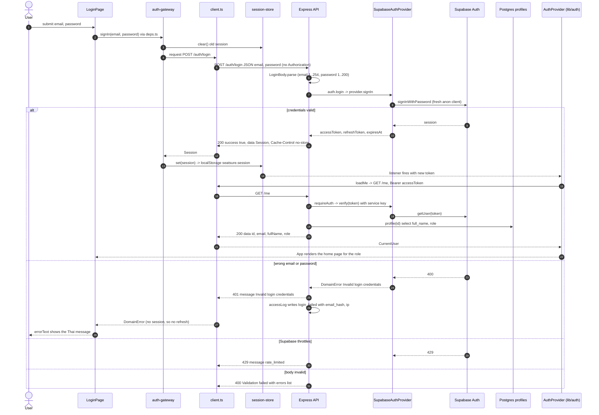

| Step | Code path | Validation or check there |
|---|---|---|
| 2 | FE `pages/LoginPage.tsx` `signIn`, `app/deps.ts` `signIn`, `use-cases/sign-in.ts` | none: passes through |
| 3 | FE `adaptor/http/auth-gateway.ts` `signIn` | clears any old session so an old token is never sent with a login |
| 5 | FE `adaptor/http/client.ts` `send` | adds no bearer because the store is empty; 15 s timeout |
| 6 | BE `adaptor/http/auth.routes.ts` `POST /auth/login` | zod `LoginBody` in `adaptor/http/contract.ts`; failure is 400 `Validation failed` |
| 7-8 | BE `use-cases/auth.ts` `login`, `adaptor/supabase/auth-provider.ts` `signIn` | a new anon client per call so concurrent sign-ins never share state |
| 9-10 | BE `auth-provider.ts` `toSession` | no session is `not_authenticated`; `expiresAt` in epoch seconds |
| 11 | BE `app.ts` header middleware | `Cache-Control: no-store` on `/auth/*` and `/me` |
| 13-14 | FE `session-store.ts` `write`, `notify`; FE `lib/auth.tsx` `AuthProvider` | token change triggers `loadMe` |
| 17-19 | BE `adaptor/http/guard.ts` `requireAuth`, `use-cases/auth.ts` `authenticate`, `auth-provider.ts` `verify`, `profile` | bearer regex; Supabase rejects the token (4xx) or there is no profile row: 401 `not_authenticated` |
| 20 | BE `use-cases/auth.ts` `me` | reads the profile again for `fullName` |
| 23-26 | BE `auth-provider.ts` `authFailure`, `adaptor/http/error-handler.ts` `statusOf`, `adaptor/http/security-log.ts` `accessLog` | 4xx from Auth becomes `Invalid login credentials` (401) and one `login_failed` log line |
| 27-28 | FE `client.ts` `request` | a 401 with no stored session is unwrapped directly, never refreshed |
| 29-30 | BE `auth-provider.ts` `authFailure` | Auth 429 becomes `rate_limited` (429) |

## Authenticated request with automatic refresh

Any call made with an expired access token is refreshed once, shared by every parallel caller, and retried once; a dead refresh token signs the user out in every tab.

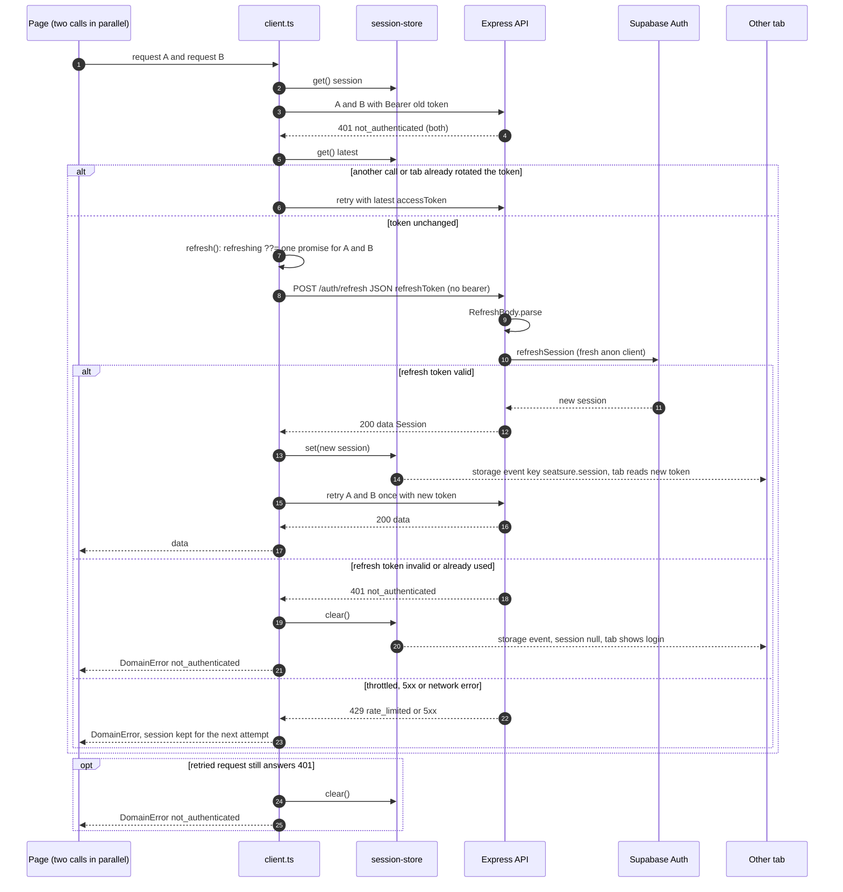

| Step | Code path | Validation or check there |
|---|---|---|
| 2-4 | FE `adaptor/http/client.ts` `request`, `send` | bearer added from `store.get()`, which reads `localStorage` each time |
| 4 | BE `adaptor/http/guard.ts`, `auth-provider.ts` `verify` | expired or revoked token: 401 `not_authenticated` |
| 5-6 | FE `client.ts` `request` | if the stored token differs from the one sent, retry with it instead of refreshing |
| 7 | FE `client.ts` `refresh` | single flight: `refreshing ??=` shares one promise, reset in `finally` |
| 8-10 | BE `adaptor/http/auth.routes.ts` `POST /auth/refresh`, `auth-provider.ts` `refresh` | zod `RefreshBody`; Auth 4xx becomes `not_authenticated`, 429 becomes `rate_limited` |
| 13-14 | FE `session-store.ts` `write`, `storage` listener | other tabs get the `storage` event and re-read; `AuthProvider` reacts to the token |
| 15 | FE `client.ts` `request` | retried at most once |
| 18-21 | FE `client.ts` `signedOut` | any 4xx except 429 from refresh clears the session |
| 22-23 | FE `client.ts` `refresh` | 429, 5xx and network errors keep the session |
| 24-25 | FE `client.ts` `request` | a 401 after the retry clears the session |

## Logout

Signing out ends the session on the server and always clears the local tokens.

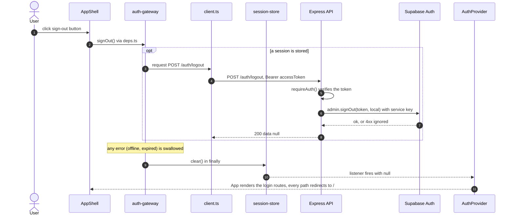

| Step | Code path | Validation or check there |
|---|---|---|
| 2 | FE `components/app-shell.tsx`, `use-cases/sign-out.ts` | none |
| 3-4 | FE `adaptor/http/auth-gateway.ts` `signOut` | calls the API only when a session exists |
| 5 | BE `adaptor/http/auth.routes.ts` `POST /auth/logout`, `requireAuth()` | 401 `not_authenticated` without a valid bearer (the client then tries one refresh) |
| 6-7 | BE `use-cases/auth.ts` `logout`, `auth-provider.ts` `signOut` | scope `local`: only this session ends; a 4xx from Auth (already gone) is ignored |
| 9 | FE `auth-gateway.ts` `signOut` | `finally` always clears the tokens |
| 10-11 | FE `lib/auth.tsx`, `App.tsx` | no session: only `/` (login) is routed |

## Browse courses

The same `GET /courses` returns a different list per role; pages poll it every 15 s.

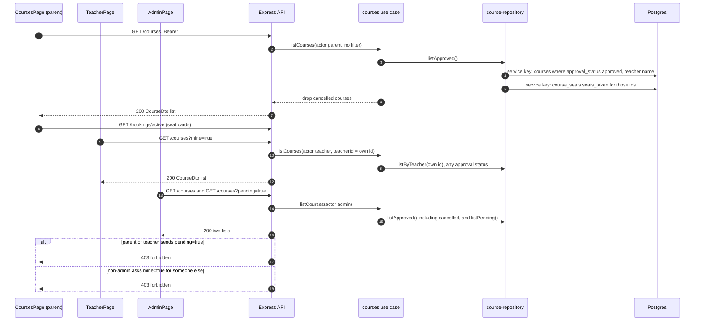

| Step | Code path | Validation or check there |
|---|---|---|
| 1 | FE `pages/CoursesPage.tsx` `load`, `use-cases/list-courses.ts`, `adaptor/http/courses-gateway.ts` `list` | `useAutoRefresh(load)`: every 15 s and on tab focus |
| 2 | BE `adaptor/http/courses.routes.ts` `GET /courses` | `requireAuth()` (any role); zod `ListQuery`: `pending` and `mine` only `true` or `false` |
| 3, 6 | BE `use-cases/courses.ts` `listCourses` | parent: approved and not cancelled; admin: approved including cancelled |
| 4-5 | BE `adaptor/supabase/course-repository.ts` `list`, `seatsOf` | service-key read; seat counts only for approved courses (`course_seats` view) |
| 8 | BE `adaptor/http/bookings.routes.ts` `GET /bookings/active`, `use-cases/bookings.ts` `activeBookings` | parent: own held or paid bookings |
| 9-11 | FE `pages/TeacherPage.tsx`; BE `listCourses` | `mine=true` sets `teacherId` to the caller; a teacher with no flag also gets only their own courses |
| 13-15 | FE `pages/AdminPage.tsx`; BE `listCourses`, `listPending` | `pending=true` needs role `admin` |
| 17-18 | BE `use-cases/courses.ts` `listCourses` | `forbidden` (403) |

## Teacher proposes a course, admin01 approves, parent sees it

A teacher's course starts pending and closed; only admin01 can approve it, which opens registration.

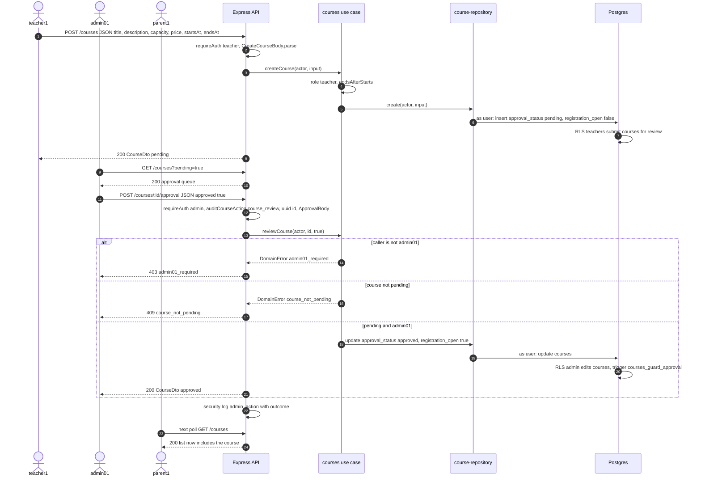

| Step | Code path | Validation or check there |
|---|---|---|
| 1 | FE `components/admin/add-course-dialog.tsx` via `pages/TeacherPage.tsx`, `use-cases/create-course.ts` | form fields |
| 2 | BE `adaptor/http/courses.routes.ts` `POST /courses` | `requireAuth(['teacher'])`; zod `CreateCourseBody`: title 1..200, description up to 2000, capacity 1..1000, price 0..1,000,000 with 2 decimals, ISO dates, end after start |
| 4 | BE `use-cases/courses.ts` `createCourse` | `forbidden` unless teacher; `invalid_course_schedule` |
| 6-7 | BE `adaptor/supabase/course-repository.ts` `create`; SQL `20261011000000_...` policy | user-token insert; RLS requires role teacher, `teacher_id = auth.uid()`, `pending`, not cancelled |
| 9-10 | FE `pages/AdminPage.tsx` (`canApproveCourses` only for admin01), `components/admin/course-approval-queue.tsx` | the UI shows the queue only to admin01 |
| 12 | BE `courses.routes.ts` `POST /courses/:id/approval` | `requireAuth(['admin'])`; non-uuid id is 404 `course_not_found`; zod `ApprovalBody` |
| 13-15 | BE `use-cases/courses.ts` `reviewCourse`, `entities/course.ts` `isSchoolAdmin` | `admin01_required` (403) for any other admin |
| 16-17 | BE `reviewCourse` | missing course 404; not `pending` is `course_not_pending` (409) |
| 18-20 | BE `course-repository.ts` `update`; SQL trigger `courses_guard_approval` | RLS `is_admin()`; trigger checks `is_school_admin()`; no row updated is `forbidden` |
| 22 | BE `adaptor/http/security-log.ts` `auditCourseAction` | one `admin_action` line with `decision`, `outcome`, `status` |
| 23-24 | FE `pages/CoursesPage.tsx` polling | the course is approved and open, so it is listed |

## Book a seat

A parent books with a student name; `book_seat` runs as the parent and serialises bookings for the course on a row lock.

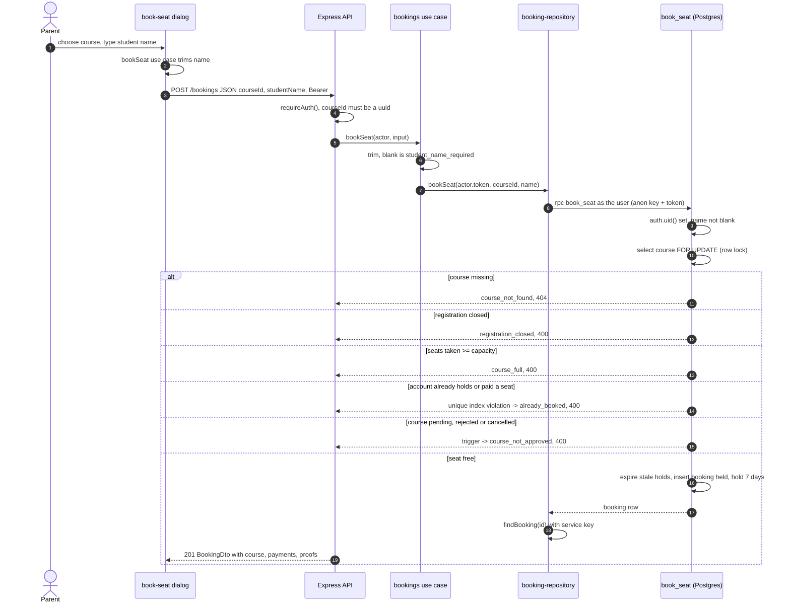

The race: 20 parents send `POST /bookings` for the last seat at the same moment
(`apps/backend/tests/integration/bookings-api.test.ts`, `r1-overbooking.test.ts`; k6 `tests/load/booking.js` does it with 10).

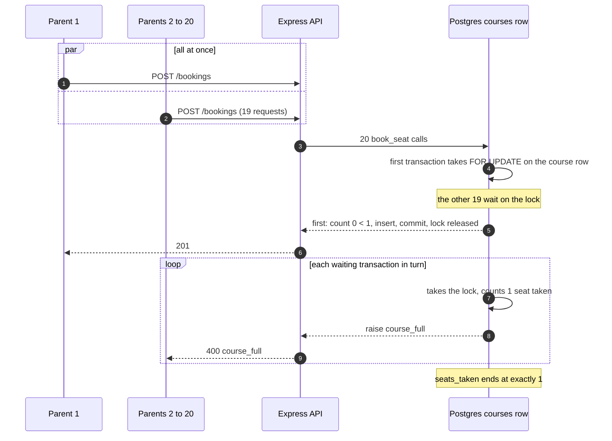

| Step | Code path | Validation or check there |
|---|---|---|
| 2 | FE `components/booking/book-seat-dialog.tsx`, `use-cases/book-seat.ts` | blank name rejected before any request |
| 3 | FE `adaptor/http/bookings-gateway.ts` `book` | JSON body |
| 4 | BE `adaptor/http/bookings.routes.ts` `POST /bookings`, `BookSeatInput` | `requireAuth()` (any role); `courseId` uuid via zod, else 400 `Validation failed` |
| 6 | BE `use-cases/bookings.ts` `bookSeat` | `student_name_required` (400) |
| 8 | BE `adaptor/supabase/booking-repository.ts` `bookSeat` | user token, so `auth.uid()` is the parent; `P0001` becomes `DomainError(message)`; `PGRST301`/`PGRST303` become `not_authenticated` |
| 9-10 | SQL `20261009000000_init.sql` `book_seat` | `select ... for update` on the course row (skipped only in the test-only `unsafe` mode) |
| 11-15 | SQL `book_seat`; trigger `bookings_require_approved_course` (`20261011000000_...`) | `course_not_found`, `registration_closed`, `course_full`, `already_booked` (unique index `bookings_one_active_per_user`), `course_not_approved` |
| 16 | SQL trigger `bookings_extend_transfer_window` | `hold_expires_at = now() + 7 days` |
| 17-19 | BE `use-cases/bookings.ts` `ownBooking`, `booking-repository.ts` `findBooking` | reads back the booking for its owner |
| race, 1-9 | SQL `book_seat` row lock; `app_settings.check_to_save_delay_ms` (100 ms in backend integration tests) widens the window | exactly one 201, the rest 400 `course_full` |

## Upload a transfer proof and confirm payment

The parent uploads the image as a raw body, then confirms; `confirm_transfer_payment` writes one payment with a receipt and is safe to repeat.

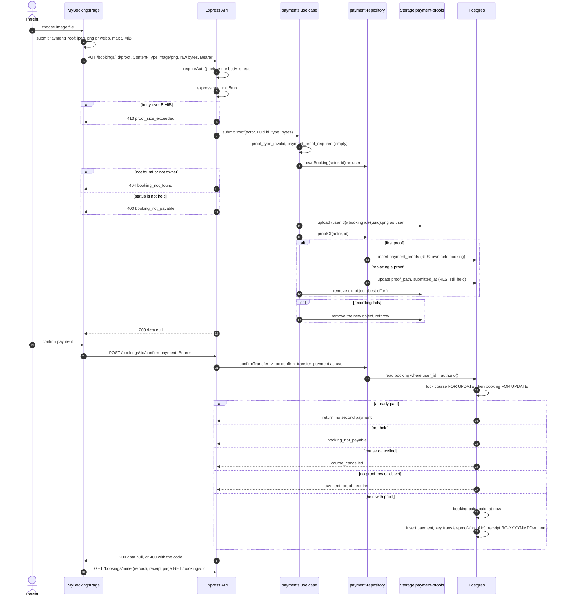

| Step | Code path | Validation or check there |
|---|---|---|
| 2 | FE `use-cases/submit-payment-proof.ts` `createSubmitPaymentProof` | type and size (convenience; the server repeats both) |
| 3 | FE `adaptor/http/payments-gateway.ts` `submitProof`, `client.ts` `send` | a `Blob` goes as the raw body with its own `content-type` |
| 4 | BE `adaptor/http/payments.routes.ts` `router.put(..., requireAuth(), proofBody, submitProof, proofTooLarge)` | auth runs first: no token is 401 before any bytes are parsed |
| 5-6 | BE `payments.routes.ts` `proofBody`, `proofTooLarge` | `express.raw` reads only the three image types; over 5 MiB is 413 `proof_size_exceeded` |
| 7 | BE `payments.routes.ts` `bookingId` | non-uuid id is 404 `booking_not_found` |
| 8 | BE `use-cases/payments.ts` `submitProof`, `entities/payment.ts` | `proof_type_invalid` (400), empty is `payment_proof_required` (400), over `MAX_PROOF_BYTES` is 413 |
| 9-11 | BE `adaptor/supabase/payment-repository.ts` `ownBooking` | user-token read filtered by `user_id`; `booking_not_found`, `booking_not_payable` |
| 12 | BE `adaptor/supabase/proof-storage.ts` `upload`; SQL storage policies | bucket limit 5 MiB and MIME list; first folder must equal `auth.uid()` |
| 13-14 | BE `payment-repository.ts` `insertProof`; SQL policy "parents submit own transfer proofs" | booking owned and `held` |
| 15-16 | BE `payment-repository.ts` `replaceProof`; SQL policy "parents replace own unconfirmed transfer proofs" | no row updated is `booking_not_payable`; old object removed quietly |
| 17 | BE `use-cases/payments.ts` `submitProof` `catch` | new object removed so no orphan stays |
| 19-20 | FE `use-cases/submit-payment-proof.ts` `createConfirmPaymentProof`, `payments-gateway.ts` `confirm` | none |
| 20-21 | BE `payments.routes.ts` `POST /bookings/:id/confirm-payment`, `use-cases/payments.ts` `confirmPayment`, `payment-repository.ts` `confirmTransfer` | `requireAuth()`; uuid id; user token so `auth.uid()` is the parent |
| 22-23 | SQL `20261016000000_confirm_locks_course.sql` `confirm_transfer_payment` | ownership; course lock then booking lock, the same order as `cancel_course` and `book_seat` |
| 24-27 | SQL `confirm_transfer_payment` | idempotent once paid; `booking_not_payable`, `course_cancelled`, `payment_proof_required` (path prefix and object must exist) |
| 28-29 | SQL `confirm_transfer_payment`; unique `payments.idempotency_key` | one payment per proof even under parallel confirms (`apps/backend/tests/integration/r2-payment.test.ts`) |

## Cancel a course with paid bookings

An admin cancels a course; one SQL function closes it, reports a refund for each paid booking and cancels the bookings, and the payments overview shows the refunds.

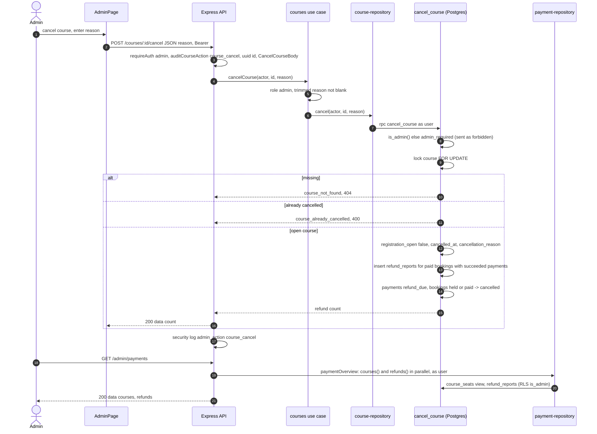

| Step | Code path | Validation or check there |
|---|---|---|
| 1-2 | FE `components/admin/cancel-course-dialog.tsx`, `use-cases/cancel-course.ts`, `courses-gateway.ts` `cancel` | reason entered |
| 3 | BE `adaptor/http/courses.routes.ts` `POST /courses/:id/cancel` | `requireAuth(['admin'])`; uuid id; zod `CancelCourseBody` (reason 1..1000) |
| 5 | BE `use-cases/courses.ts` `cancelCourse` | `forbidden`, `cancellation_reason_required` |
| 7 | BE `adaptor/supabase/course-repository.ts` `cancel`, `failure` | user token; `admin_required` maps to `forbidden` |
| 8-9 | SQL `20261010000000_course_cancellation_refunds.sql` `cancel_course` | `is_admin()`; course row lock (serialises with `confirm_transfer_payment`, see `apps/backend/tests/integration/cancel-confirm-race.test.ts`) |
| 12-15 | SQL `cancel_course` | refunds only for `paid` bookings with `succeeded` payments; `on conflict (payment_id) do nothing` |
| 16 | FE `pages/AdminPage.tsx` | toast with the number of refund rows |
| 17 | BE `adaptor/http/security-log.ts` `auditCourseAction` | outcome `ok` or the error code |
| 18-21 | FE `pages/PaymentsPage.tsx`, `use-cases/load-payment-system.ts`; BE `payments.routes.ts` `GET /admin/payments`, `use-cases/payments.ts` `paymentOverview`, `payment-repository.ts` `courses`, `refunds` | `requireAuth(['admin'])` and `requireAdmin` in the use case; RLS `admins read refund reports` |

## Course roster and the admin01 proof URL

The roster endpoint returns the same rows to every allowed viewer but fetches only the columns that viewer may see; only admin01 gets signed proof URLs.

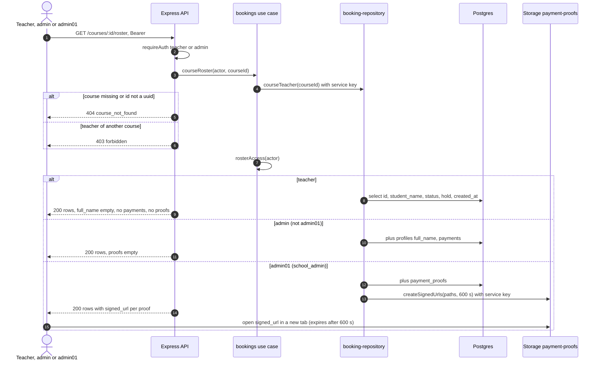

| Step | Code path | Validation or check there |
|---|---|---|
| 1 | FE `pages/AdminPage.tsx`, `pages/PaymentsPage.tsx`, `use-cases/load-course-roster.ts`, `bookings-gateway.ts` `roster` | the teacher screen lists students from `GET /bookings/active` instead (`pages/TeacherPage.tsx`) |
| 2 | BE `adaptor/http/bookings.routes.ts` `GET /courses/:id/roster` | `requireAuth(['teacher', 'admin'])` |
| 3-6 | BE `use-cases/bookings.ts` `courseRoster`, `booking-repository.ts` `courseTeacher` | non-uuid or missing course: 404; teacher must own the course |
| 7 | BE `entities/booking.ts` `rosterAccess`, `canViewProofImages` | `school_admin` only for role admin with email `admin01@seatsure.test` |
| 8-12 | BE `booking-repository.ts` `roster`, `ROSTER` column sets | hidden columns are never selected |
| 13-14 | BE `booking-repository.ts` `roster`, `PROOF_URL_SECONDS` | only `school_admin` selects proofs, so only it gets signed URLs |
| 15 | FE `components/admin/roster-dialog.tsx` | link shown only when `signed_url` is set; `pages/PaymentsPage.tsx` `canViewProofs` |

## Request pipeline inside the API

Every request passes the same middleware in `app.ts`; errors from any step end in `errorHandler` and leave in the envelope.

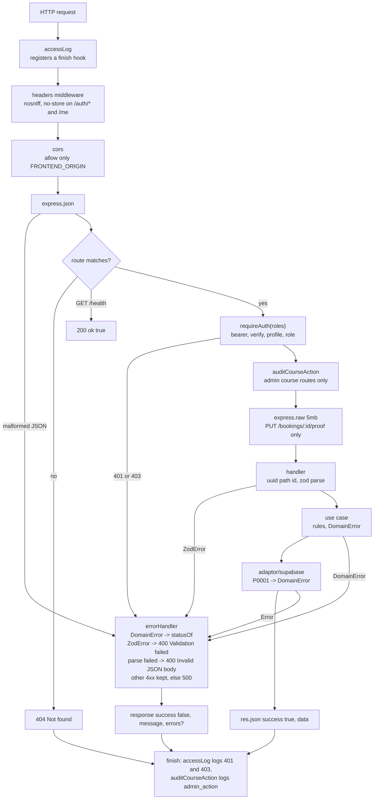

| Step | Code path | Validation or check there |
|---|---|---|
| accessLog | BE `adaptor/http/security-log.ts` `accessLog` | on finish: `login_failed` for `POST /auth/login` 401, else `unauthorized` or `forbidden` with the route pattern |
| headers | BE `app.ts` | `X-Content-Type-Options: nosniff`; `Cache-Control: no-store` when the path matches `NO_STORE`; `x-powered-by` disabled |
| cors | BE `app.ts` `cors({ origin })` | only `FRONTEND_ORIGIN` gets CORS headers |
| json | BE `app.ts` `express.json()` | malformed JSON is `entity.parse.failed`, 400 `Invalid JSON body` |
| requireAuth | BE `adaptor/http/guard.ts` | `Bearer` regex, `authenticate`, role list; sets `req.actor` before the role check |
| audit | BE `security-log.ts` `auditCourseAction` | only for actors with role admin, on PATCH, approval and cancel routes |
| raw | BE `payments.routes.ts` `proofBody` | only the three image types, 5 MiB |
| handler | BE `*.routes.ts` | `courseId`, `bookingId` uuid checks; zod schemas from `contract.ts` |
| use case | BE `use-cases/*.ts` | business rules, `DomainError(code)` |
| adaptor | BE `adaptor/supabase/*.ts` | known SQL codes become `DomainError`; anything else an `Error` without the database message |
| errorHandler | BE `adaptor/http/error-handler.ts` | `statusOf`: 401, 403, 404 for `*_not_found`, 409 `course_not_pending`, 429, else 400; 500 `Internal server error` |
| 404 | BE `app.ts` | unknown route is `404 Not found` |

## Test and release flows

### Starting the stack: `task up`

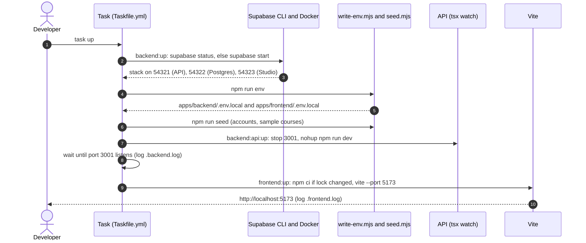

### Running the tests: `task test`

Which services each level needs.

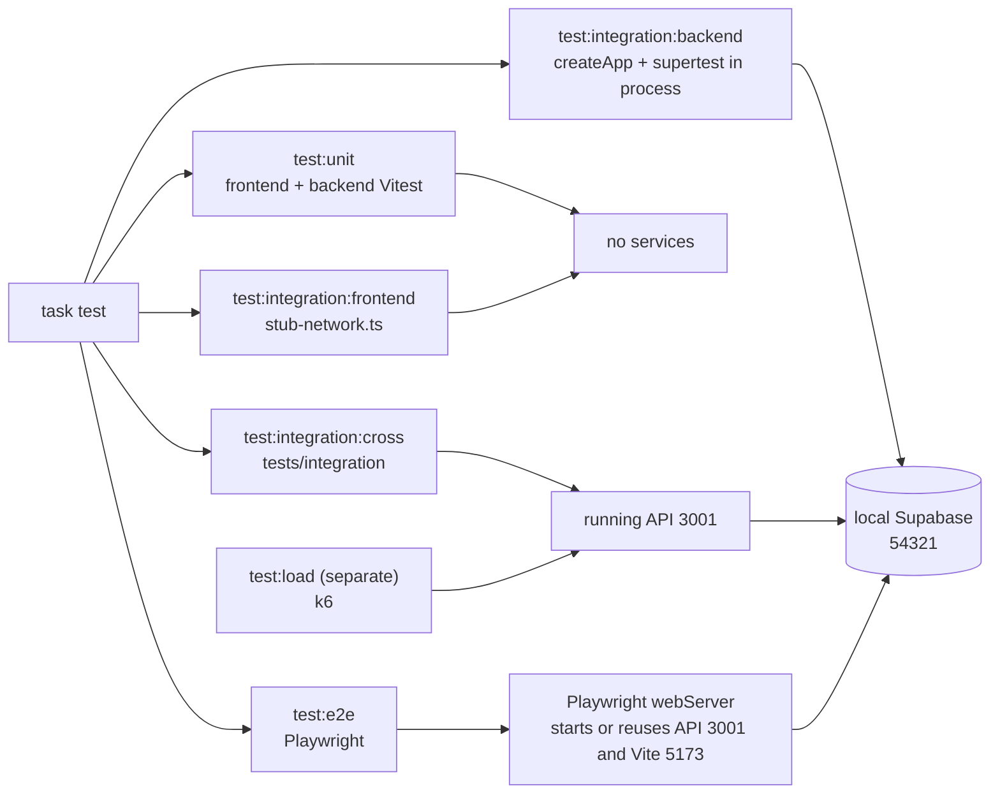

| Level | Command | Touches | Code path |
|---|---|---|---|
| Unit | `task test:unit` | nothing: fakes only | `apps/frontend/tests/unit/`, `apps/backend/tests/unit/` (`fake-deps.ts`) |
| Frontend integration | `task test:integration:frontend` | stubbed `fetch` | `apps/frontend/tests/integration/` |
| Backend integration | `task test:integration:backend` (depends on `backend:up`) | local Supabase; the API is built in process with `createApp` and the real adaptors | `apps/backend/tests/integration/`, `global-setup.ts` sets `booking_mode` and a 100 ms delay |
| Cross-app | `task test:integration:cross` (depends on `backend:up`) | the API running on 3001 (start it with `task up`) and Supabase | `tests/integration/frontend-backend-contract.test.ts`, `tests/vitest.config.ts` |
| E2E | `task test:e2e` | Playwright starts or reuses the API and Vite; Supabase must run | `tests/e2e/`, `tests/playwright.config.ts` |
| Load | `task test:load` | the running API and Supabase | `tests/load/*.js` |

### CI on a pull request

Four jobs start in parallel; none waits for another.

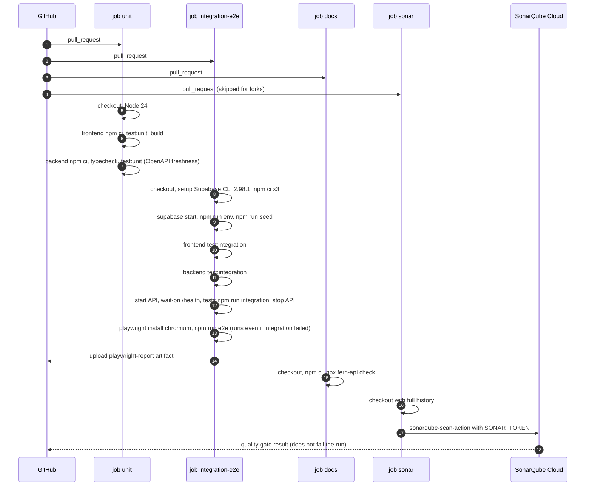

| Step | Code path | Validation or check there |
|---|---|---|
| trigger | `.github/workflows/ci.yml` `on` | push to `main`, every pull request, manual dispatch; `concurrency` cancels older runs of the same ref |
| 5-7 | `ci.yml` job `unit` | frontend unit tests and build; backend typecheck and unit tests, including `tests/unit/openapi.test.ts` |
| 8-9 | `ci.yml` job `integration-e2e` | local Supabase on the runner, never the cloud project; same CLI version as local |
| 10-12 | `ci.yml` steps | each suite in order; cross-app starts the API with `npm start` and stops it before e2e |
| 13 | `ci.yml`, `tests/playwright.config.ts` | e2e runs if Supabase started (`steps.backend.outcome == 'success'`); in CI Playwright starts its own servers, 2 retries |
| 15 | `ci.yml` job `docs` | `fern-api check` must pass |
| 16-18 | `ci.yml` job `sonar`, `sonar-project.properties` | skipped for fork pull requests (no secrets); `sonar.qualitygate.wait` stays false |
