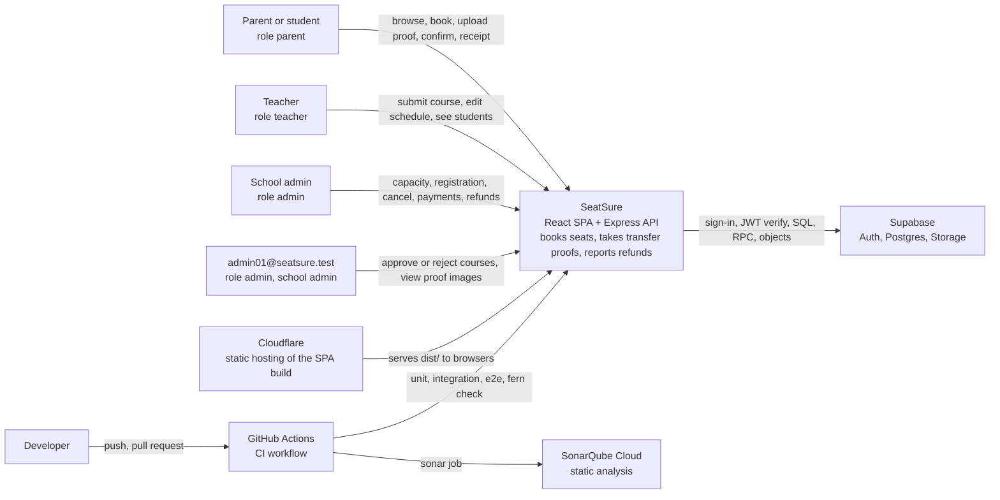
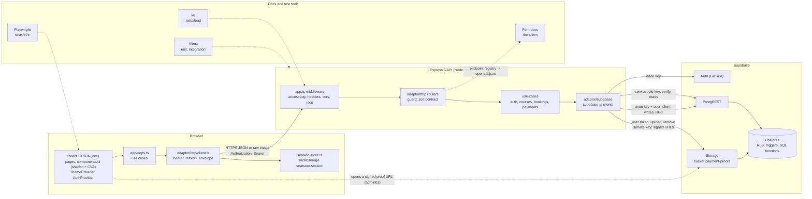
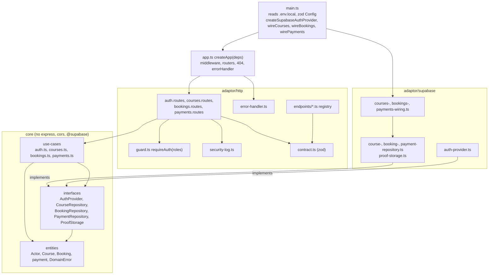
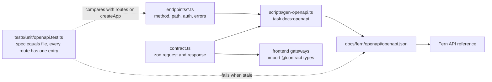
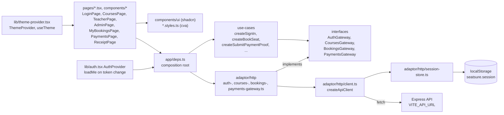
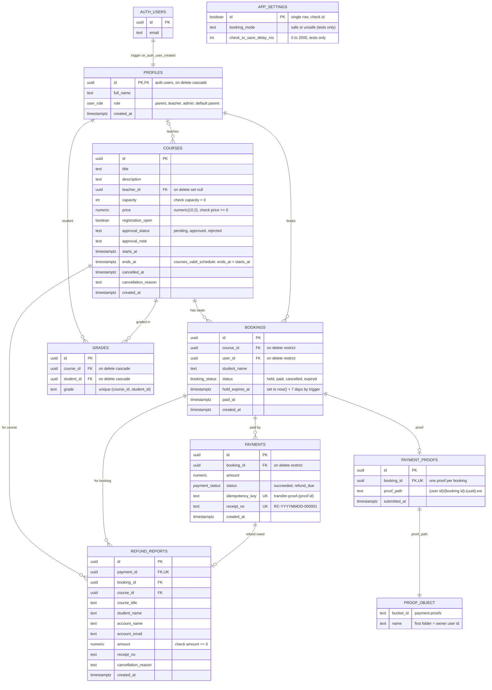
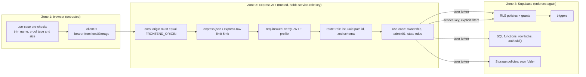
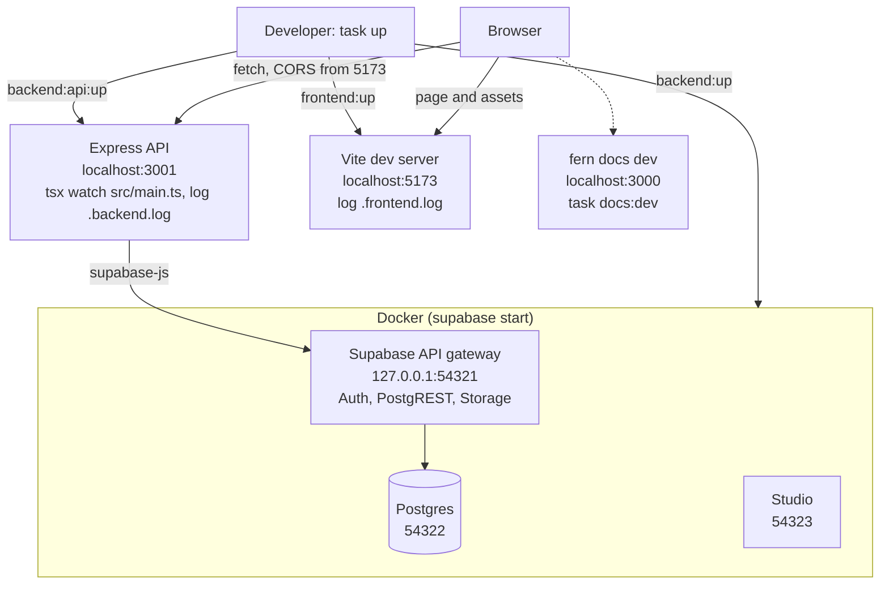

This page draws the whole system from the code. The import rules of each app are in [Architecture](/architecture); the
step-by-step flows are in [Sequence diagrams](/sequence-diagrams). Every box names the file that implements it.

## Context

Who uses SeatSure and which outside services it depends on.

| External | What SeatSure uses it for | Code |
|---|---|---|
| Supabase Auth | password sign-in, refresh, sign-out, verifying the bearer token | `apps/backend/src/adaptor/supabase/auth-provider.ts` |
| Supabase Postgres (via PostgREST) | tables, RLS, triggers, the SQL functions `book_seat`, `confirm_transfer_payment`, `cancel_course` | `apps/backend/supabase/migrations/*.sql`, `apps/backend/src/adaptor/supabase/*-repository.ts` |
| Supabase Storage | bucket `payment-proofs` (private, 5 MiB, jpeg/png/webp) | `apps/backend/src/adaptor/supabase/proof-storage.ts`, `20261011000000_teacher_courses_and_transfer_proofs.sql` |
| Cloudflare | serves the Vite build as a single-page app (`not_found_handling: single-page-application`); `npm run deploy` runs `wrangler deploy` | `apps/frontend/wrangler.jsonc`, `apps/frontend/package.json` |
| GitHub Actions | jobs `unit`, `integration-e2e`, `docs`, `sonar` on push to `main` and on pull requests | `.github/workflows/ci.yml` |
| SonarQube Cloud | scans `apps/frontend/src` and `apps/backend/src`; the quality gate does not fail the pipeline yet | `sonar-project.properties` |

The API is not hosted yet: it runs locally and in CI (`README.md`, "Host the API"). Development and CI always use a local
Supabase stack in Docker; the cloud project is only seeded by hand (`npm run cloud:seed` in `apps/backend`).

## Containers

What runs where and how the parts talk.

- The browser has no Supabase client and no Supabase key (`apps/frontend/tests/unit/layering.test.ts` fails on any
  `@supabase/*` import). The one direct contact is a time-limited signed URL to a proof image that admin01 opens from the
  roster (`components/admin/roster-dialog.tsx`).
- The request and response shapes are the zod schemas in `apps/backend/src/adaptor/http/contract.ts`; the frontend imports
  the same file through the `@contract` alias (`apps/frontend/vite.config.ts`).
- Fresh data comes from polling: `useAutoRefresh` reloads every 15 s and when the tab becomes visible
  (`apps/frontend/src/lib/use-auto-refresh.ts`).

## Backend layers

Dependencies point inwards. `app.ts` builds the HTTP app from ports; `main.ts` builds the Supabase adaptors.

The import rule (`apps/backend/tests/unit/layering.test.ts`): `entities` import nothing from another layer, `interfaces`
import only `entities`, `use-cases` import `entities` and `interfaces`, and none of the three imports `express`, `cors` or
`@supabase/*`. Unit tests call `createApp` with fakes (`apps/backend/tests/unit/api/fake-deps.ts`).

| Group | Router | Use case | Port | Supabase adaptor | Client it uses |
|---|---|---|---|---|---|
| auth | `auth.routes.ts` | `createAuth` (`use-cases/auth.ts`) | `AuthProvider` | `createSupabaseAuthProvider` | anon client per sign-in or refresh; service client for verify, profile, sign-out |
| courses | `courses.routes.ts` | `createCourses` | `CourseRepository` | `createSupabaseCourseRepository` | service client for reads and seat counts; anon key + user token for insert, update and `cancel_course` |
| bookings | `bookings.routes.ts` | `createBookings` | `BookingRepository` | `createSupabaseBookingRepository` | anon key + user token for `book_seat`; service client for every read and for signing proof URLs |
| payments | `payments.routes.ts` | `createPayments` | `PaymentRepository`, `ProofStorage` | `createSupabasePaymentRepository`, `createSupabaseProofStorage` | anon key + user token for everything, including Storage (`payments-wiring.ts`) |

Each router builds its use case from the ports it receives (for example `createCourses(deps.courseRepository)` inside
`coursesRoutes`); `createApp` hands every router its ports and the shared `requireAuth`.

### Single source of truth for the HTTP surface

## Frontend layers

`main.tsx` nests `ThemeProvider`, `BrowserRouter`, `AuthProvider` and `TooltipProvider` around `App`; `App.tsx` picks the
home page by role (`AdminPage`, `TeacherPage` or `CoursesPage`). Use cases take a gateway port and throw
`DomainError(code)`; pages turn codes into Thai text with `errorText` (`src/lib/format.ts`).

## Data model

Tables in `public`, read from `apps/backend/supabase/migrations/`. `auth.users` belongs to Supabase Auth.

| Constraint or object | What it guarantees | Where |
|---|---|---|
| `bookings_one_active_per_user`, unique on `(course_id, user_id)` where `status in ('held','paid')` | one live booking per account per course; a second insert is `already_booked` | `20261009000000_init.sql` |
| `payments.idempotency_key` unique, `payments.receipt_no` unique | one payment per proof, one receipt number per payment | `20261009000000_init.sql` |
| `payment_proofs.booking_id` unique | one proof row per booking; a new upload replaces it | `20261011000000_...transfer_proofs.sql` |
| `refund_reports.payment_id` unique | one refund row per payment (`on conflict do nothing` in `cancel_course`) | `20261010000000_course_cancellation_refunds.sql` |
| `courses_valid_schedule` | `ends_at` after `starts_at` (mapped to `invalid_course_schedule`) | `20261011000000_...transfer_proofs.sql` |
| view `course_seats` | approved courses with live `seats_taken` (paid plus unexpired holds) | `20261011000000_...transfer_proofs.sql` |
| bucket `payment-proofs` | private, `file_size_limit` 5242880, jpeg/png/webp; policies limit writes to the `(user id)/` folder; `is_school_admin()` may read all | `20261011000000_...`, `20261012000000_...`, `20261014000000_...` |

### SQL functions and triggers

| Name | Kind | Called by | Does |
|---|---|---|---|
| `book_seat(p_course_id, p_student_name)` | function, security definer | `booking-repository.ts` `bookSeat`, as the user | locks the course row, expires stale holds, counts seats, inserts the booking; raises `course_full`, `registration_closed`, `already_booked`, `course_not_found`, `student_name_required`, `not_authenticated` |
| `confirm_transfer_payment(p_booking_id)` | function, security definer | `payment-repository.ts` `confirmTransfer`, as the user | locks course then booking, returns if already paid, checks the proof row and object, marks paid, writes one payment with a receipt |
| `cancel_course(p_course_id, p_reason)` | function, security definer | `course-repository.ts` `cancel`, as the user | `is_admin()` check, locks the course, closes it, writes refund reports, marks payments `refund_due` and bookings `cancelled`, returns the refund count |
| `pay_booking` | function, retired | nobody | always raises `bank_transfer_only` (`20261011000000_...`) |
| `my_role`, `is_admin`, `is_school_admin`, `seats_taken` | helper functions | RLS policies, triggers, the view | role of `auth.uid()`; admin01 check by email; seat count |
| `handle_new_user` | trigger on `auth.users` | Supabase Auth sign-up | creates the `profiles` row with role `parent` |
| `bookings_require_approved_course` | trigger on `bookings` insert | `book_seat` | `course_not_approved` unless the course is approved and not cancelled |
| `bookings_extend_transfer_window` | trigger on `bookings` insert | `book_seat` | `hold_expires_at = now() + 7 days` (overrides the 10 minutes in `book_seat`) |
| `courses_guard_capacity` | trigger on `courses` update | admin update | `capacity_below_booked` |
| `courses_prevent_cancelled_reopen` | trigger on `courses` update | admin update | `course_cancelled` when reopening a cancelled course |
| `courses_guard_approval` | trigger on `courses` update | review | `admin01_required` unless `is_school_admin()` |
| `courses_teacher_schedule_only` | trigger on `courses` update | teacher update | `teachers_may_only_change_schedule` |

A function raises `exception '<code>'`; PostgREST returns it as `P0001` and the adaptor turns it into `DomainError(code)`
(`booking-repository.ts`, `payment-repository.ts`, `course-repository.ts` `failure`, which also maps `admin_required` and
`teachers_may_only_change_schedule` to `forbidden`).

## Trust zones and security boundaries

| Check | Where it happens | Code |
|---|---|---|
| Proof type and size, blank student name (convenience only, repeated on the server) | browser use case | `apps/frontend/src/use-cases/submit-payment-proof.ts`, `book-seat.ts` |
| Origin allow-list | API middleware | `apps/backend/src/app.ts` (`cors`, origin must equal `FRONTEND_ORIGIN`) |
| Body size and JSON syntax | API middleware | `express.json()` in `app.ts`; `express.raw({ limit: '5mb' })` and `proofTooLarge` in `payments.routes.ts` |
| Bearer verification | `requireAuth` | `adaptor/http/guard.ts` `createRequireAuth` -> `use-cases/auth.ts` `authenticate` -> `auth-provider.ts` `verify` (`service.auth.getUser`) and `profile` |
| Role allowed for the route | `requireAuth(['admin'])` and friends | `courses.routes.ts`, `bookings.routes.ts`, `payments.routes.ts` |
| Path id is a uuid | route | `courseId` in `courses.routes.ts`, `bookingId` in `payments.routes.ts`, `UUID` test in `booking-repository.ts` |
| Request body shape and bounds | route, zod | `contract.ts` (`LoginBody`, `CreateCourseBody`, `UpdateCourseBody`, `ApprovalBody`, `CancelCourseBody`, `BookSeatBody`) |
| Business rule | use case | `isSchoolAdmin` in `reviewCourse`, owner checks in `ownBooking` and `courseRoster`, `rosterAccess`, schedule and capacity rules in `updateCourse`, `booking_not_payable` in `submitProof` |
| Row visibility and writes | RLS | policies in `20261009000000_init.sql` and later migrations (applies only to user-token clients) |
| Seat count, duplicates, payment, cancellation | SQL functions with row locks | `book_seat`, `confirm_transfer_payment`, `cancel_course` |
| Proof objects | Storage policies | folder must equal `auth.uid()`; `is_school_admin()` reads all |

### Which key is used where

| Client | Key | Used for | RLS applies |
|---|---|---|---|
| Browser | none | calls only the API; opens signed proof URLs | n/a |
| `anon()` in `auth-provider.ts` | anon key, no user | `signInWithPassword`, `refreshSession` (fresh client per call) | n/a (Auth) |
| `asUser(token)` / `clientFor(actor)` | anon key + `Authorization: Bearer (user token)` | course insert and update, `cancel_course`, `book_seat`, `confirm_transfer_payment`, every payments read and write, proof upload and removal | yes, and `auth.uid()` is the user |
| `service` | service-role key | token verify, profile lookup, `admin.signOut`; course lists, `find`, `course_seats`; every bookings read; roster; `createSignedUrls` (600 s) | no: the use case filters (`eq('user_id', ...)`, owner checks, roster columns per viewer) |

The service-role key lives only in `apps/backend/.env.local` (and `apps/frontend/.env.local` for the seed script and the
tests, which the browser bundle never reads: Vite exposes only `VITE_` variables and the code reads only `VITE_API_URL`).

## Runtime topology (local)

| Component | Responsibility | Technology | Code path |
|---|---|---|---|
| SPA | screens per role, Thai UI, theme | React 19, Vite, Tailwind v4, shadcn/ui, cva, react-router | `apps/frontend/src/main.tsx`, `App.tsx`, `pages/`, `components/` |
| HTTP client | bearer, single-flight refresh, 15 s timeout, envelope to `DomainError` | `fetch`, `AbortSignal` | `apps/frontend/src/adaptor/http/client.ts` |
| Session store | tokens shared across tabs, memory fallback | `localStorage`, `storage` event | `apps/frontend/src/adaptor/http/session-store.ts` |
| Theme | light, dark, system; no flash | `ThemeProvider`, inline script | `apps/frontend/src/lib/theme-provider.tsx`, `lib/theme.ts`, `index.html` |
| API process | config, wiring, listen | Node, tsx, zod | `apps/backend/src/main.ts` |
| HTTP app | middleware, routers, errors | Express 5, cors | `apps/backend/src/app.ts`, `adaptor/http/` |
| Business rules | one factory per area | TypeScript | `apps/backend/src/use-cases/` |
| Data adaptors | Supabase calls, error mapping | `@supabase/supabase-js` | `apps/backend/src/adaptor/supabase/` |
| Database | schema, RLS, triggers, SQL functions | Postgres (Supabase) | `apps/backend/supabase/migrations/` |
| Auth | users, JWT | Supabase Auth | `auth-provider.ts`, `supabase/config.toml` |
| Proof files | images | Supabase Storage | `proof-storage.ts`, bucket `payment-proofs` |
| Env and seed | write `.env.local`, seed users and courses | Node scripts | `apps/backend/scripts/write-env.mjs`, `seed.mjs` |
| Docs | guides and API reference | Fern | `docs/fern/`, `apps/backend/scripts/gen-openapi.ts` |
| Unit and integration tests | per app and cross-app | Vitest, supertest | `apps/*/tests/`, `tests/integration/` |
| E2E | browser flows | Playwright (Chromium) | `tests/e2e/`, `tests/playwright.config.ts` |
| Load | smoke, auth, last-seat race | k6 | `tests/load/` |
| Task runner | start, stop, test, docs | Task | `Taskfile.yml` |
| CI and analysis | tests, fern check, scan | GitHub Actions, SonarQube Cloud | `.github/workflows/ci.yml`, `sonar-project.properties` |
| Hosting (SPA) | static assets with SPA fallback | Cloudflare (wrangler) | `apps/frontend/wrangler.jsonc` |

## Cross-cutting concerns

| Concern | How | Code |
|---|---|---|
| Error envelope | success is `{ success: true, data }`; failure is `{ success: false, message, errors? }`; `DomainError` codes map to 401, 403, 404, 409, 429 or 400; unknown errors are 500 `Internal server error` with the detail only in the server log | `adaptor/http/error-handler.ts`; parsed back by `unwrap` in `apps/frontend/src/adaptor/http/client.ts` |
| Security log | one JSON line on stdout for each failed login, 401, 403 and admin course action; no tokens, bodies or clear emails | `adaptor/http/security-log.ts` (`accessLog`, `auditCourseAction`) |
| Response headers | no `X-Powered-By`; `X-Content-Type-Options: nosniff`; `Cache-Control: no-store` on `/auth/*` and `/me` | `app.ts` |
| Configuration | `task up` runs `write-env.mjs`: `apps/backend/.env.local` (`SUPABASE_URL`, `SUPABASE_ANON_KEY`, `SUPABASE_SERVICE_ROLE_KEY`, `FRONTEND_ORIGIN`, `API_PORT`) and `apps/frontend/.env.local` (`VITE_API_URL`, plus Supabase keys for seed and tests); `main.ts` validates with zod and exits naming what is missing; `resolveApiBase` throws in a production build without `VITE_API_URL` | `apps/backend/scripts/write-env.mjs`, `apps/backend/src/main.ts`, `apps/frontend/src/adaptor/http/client.ts` |
| Freshness | polling every 15 s and on tab focus; no Realtime | `apps/frontend/src/lib/use-auto-refresh.ts` |
| Docs as source of truth | registry and contract generate the OpenAPI file that Fern renders; a stale file fails a unit test | `adaptor/http/endpoints/`, `scripts/gen-openapi.ts`, `tests/unit/openapi.test.ts` |

## Decisions and trade-offs

**An API in front of Supabase.** Business rules live in one tested place (use cases with fake ports), the browser holds no
Supabase key, and both apps share one zod contract. The cost is an extra hop and a second layer of auth: the API must
forward the user's token for writes so RLS, triggers and `auth.uid()` in the SQL functions still apply. Decision record:
`docs/superpowers/specs/2026-10-10-backend-api-split-design.md`.

**Service-role reads with explicit filters.** Reads such as the roster, a parent's bookings with joined course, payments
and proofs, and seat counts need data that RLS would hide from one user, or would make slow to assemble. The adaptors read
with the service key and the use case decides who may see what (`ownBooking`, `courseRoster`, `rosterAccess`, which also
drives which columns are selected, so hidden data is never fetched). The cost: a missing filter in a use case leaks data, so
these rules have unit tests and RLS no longer backs them up on those reads. Writes stay on the user token.

**Polling, not Realtime.** With supabase-js gone from the browser there is no Realtime channel, and `supabase/config.toml`
disables Realtime. Pages reload every 15 s and on tab focus. Correctness does not depend on fresh screens: the SQL
functions decide seats and payments under row locks, so a stale page can only get a clear error such as `course_full`.

## Known gaps

From `docs/notes/2026-10-10-security-hardening.md` (not fixed, each needs a decision):

| ID | Gap |
|---|---|
| M1 | Open sign-up and 7-day holds: an account can hold seats for a week. |
| M2 | Parents confirm their own transfer; there is no admin review state before `paid`. |
| M3 | A user's JWT also works directly against PostgREST and Storage; column grants, the `app_settings` update grant and the JWT lifetime are unchanged. |
| M6 | No rate limiting in the API; only Supabase Auth limits sign-in and refresh (`rate_limited`). |
| L3 | Proof images are checked by `Content-Type` only, not by magic bytes. |
| L4 | No default-privileges migration for future objects. |
| L5 | An expired hold can still be confirmed. |
| L7 | Staff accounts (teacher, admin) can book. |
| I1-I6 | Informational: admin01 by email, teacher sees parents' ids, P0001 allow-list, `shadcn` in dependencies, preflight envelope, proof cleanup. |

Also open: the API is not hosted, tokens live in `localStorage` (httpOnly cookies are out of scope), and the security log
goes to stdout only.
