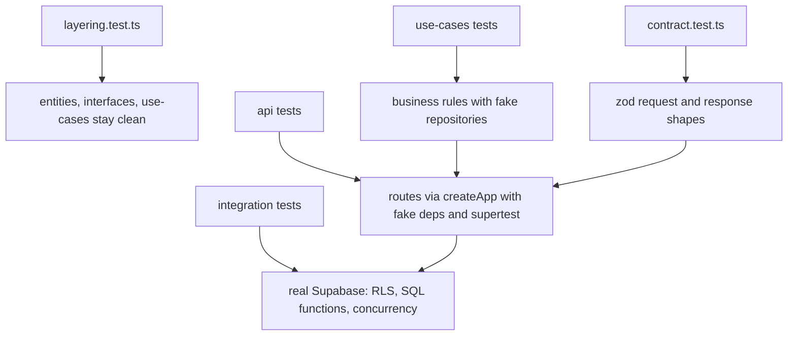

Inventory of `apps/backend/tests/**`, read from the test files. For the levels and rules see [Testing](/testing); for the rules
the tests enforce see [Backend](/backend) and [API conventions](/api-conventions). Counts come from a real run
(`vitest --reporter=json`) on 2026-10-11.

## 1. Overview

Vitest runs two projects (`apps/backend/vitest.config.ts`).

| Project | Files | Tests | Services | Parallelism | Command |
|---|---|---|---|---|---|
| `unit` | `tests/unit/**/*.test.ts`: 17 files | 344 | none | default | `task test:unit` (frontend too) or `cd apps/backend && npm run test:unit` |
| `integration` | `tests/integration/**/*.test.ts`: 7 files | 72 | real local Supabase (`task up`) | `fileParallelism: false`, `testTimeout` 30 s, `hookTimeout` 60 s | `task test:integration:backend` |

Other commands: `task test:ui:backend` (Vitest UI, both projects), `cd apps/backend && npm run test:unsafe` (integration in
`unsafe` mode, section 5), `task test` (every level, including frontend and e2e). Result of the run used here: 344 of 344 unit and 72 of 72
integration passed.

**Unit project.** No network, no env file. API tests call `createApp(deps)` and drive it with supertest:

- `tests/unit/api/fake-deps.ts` builds the full `AppDeps`. Ports a test does not pass are a Proxy that throws
  `port "<name>" was not faked`, so a route cannot pass through an unfaked dependency by accident.
- `tests/unit/api/fake-auth-provider.ts`: in-memory accounts, tokens `token-<id>`, refresh tokens `refresh-<id>-<n>`.
- `tests/unit/courses-fake-repository.ts`, `bookings-fake-repository.ts`, `payments-fakes.ts`: in-memory ports that record writes
  and can fail on demand (`failWith`, `failNextSave`, `replaceFindsNoRow`).
- `api/bookings.test.ts` and `api/payments.test.ts` build `AppDeps` by hand (cast) instead of `fakeAppDeps`; same idea.

**Integration project.** Tests send HTTP through supertest into `createApp` with the real Supabase adaptors (`createSupabaseAuthProvider`,
`wireCourses`, `wireBookings`, `wirePayments`); no listening process is needed. `r1-overbooking.test.ts` and `security.test.ts`
skip the API and call the SQL functions and tables with a user JWT, to test Postgres itself.

- `global-setup.ts` reads `VITE_SUPABASE_URL` and `SUPABASE_SERVICE_ROLE_KEY` (from `apps/frontend/.env.local`, written by
  `task up`), writes `app_settings.booking_mode` (`safe` or `unsafe`, from `BOOKING_MODE`) and
  `check_to_save_delay_ms = 100`, prints `Booking mode under test: <mode>`, and its teardown always sets `safe` and `0` again.
- `helpers.ts` `cleanup()` runs in each file's `afterAll`: refund reports, payment proofs, payments, bookings, courses, proof
  objects in storage, then the auth users the file created. A failed step throws (`cleanup: <step>: ...`) instead of hiding leftovers.
  After the runs for this page the database held no `Test*` or `API*` courses and `app_settings` was `safe` / `0`.

Per-file counts:

| File | Project | Tests | Section |
|---|---|---|---|
| `unit/layering.test.ts` | unit | 10 | 2.1 |
| `unit/contract.test.ts` | unit | 76 | 2.2 |
| `unit/openapi.test.ts` | unit | 26 | 2.3 |
| `unit/api/security-log.test.ts` | unit | 15 | 2.4 |
| `unit/api/error-handler.test.ts` | unit | 11 | 2.5 |
| `unit/api/guard.test.ts` | unit | 5 | 2.5 |
| `unit/api/auth.test.ts` | unit | 15 | 2.6 |
| `unit/use-cases/auth.test.ts` | unit | 5 | 2.6 |
| `unit/adaptor/supabase-auth-errors.test.ts` | unit | 3 | 2.6 |
| `integration/auth-api.test.ts` | integration | 7 | 2.6 |
| `unit/api/courses.test.ts` | unit | 24 | 2.7 |
| `unit/use-cases/courses.test.ts` | unit | 45 | 2.7 |
| `integration/courses-api.test.ts` | integration | 16 | 2.7 |
| `unit/api/bookings.test.ts` | unit | 23 | 2.8 |
| `unit/use-cases/bookings.test.ts` | unit | 27 | 2.8 |
| `integration/bookings-api.test.ts` | integration | 14 | 2.8 |
| `unit/api/payments.test.ts` | unit | 21 | 2.9 |
| `unit/use-cases/payments.test.ts` | unit | 22 | 2.9 |
| `integration/r2-payment.test.ts` | integration | 18 | 2.9 |
| `unit/api/health.test.ts` | unit | 4 | 2.10 |
| `unit/api/headers.test.ts` | unit | 12 | 2.10 |
| `integration/r1-overbooking.test.ts` | integration | 6 | 2.11 |
| `integration/cancel-confirm-race.test.ts` | integration | 1 | 2.12 |
| `integration/security.test.ts` | integration | 10 | 2.13 |
| `integration/helpers.ts`, `global-setup.ts` | integration | none (helpers) | 2.14 |
| **Total** | | **344 unit + 72 integration = 416** | |

The fake repositories and fakes (`*-fake-repository.ts`, `payments-fakes.ts`, `fake-*.ts`) hold no tests.

The **Layer** column names where the rule under test lives: `entity`, `contract` (zod in `contract.ts`), `guard`
(`requireAuth`), `use case`, `HTTP` (routes, error handler, log, headers), `registry` (endpoint registry and OpenAPI),
`Supabase adaptor`, `DB` (RLS, trigger, SQL function, storage policy) and `structure` (import rules).

## 2. Tests by file

### 2.1 Layering: `unit/layering.test.ts` (10)

Reads every `.ts` under `src/entities`, `src/interfaces`, `src/use-cases` and checks the import specifiers. No input besides the source tree.

| Test name | Input / setup | What is validated / expected | Layer |
|---|---|---|---|
| `import scanner` (7 cases, named `<line> -> banned: <bool>`) | one line of code per case: `import express from 'express'`, `import 'express'`, `require('express')`, `await import('@supabase/supabase-js')`, `import ... from '../adaptor/x'` (all banned); `./express-helper`, `../entities/x` (allowed) | the scanner itself: bare packages (`express`, `cors`, `@supabase`) and any relative path containing an outer layer segment are caught, look-alike file names are not | structure |
| `entities imports nothing from an outer layer or a framework` | all files in `src/entities` | no `interfaces`, `use-cases`, `adaptor` path, no `express`, `cors`, `@supabase` | structure |
| `interfaces imports nothing from an outer layer or a framework` | all files in `src/interfaces` | no `use-cases`, `adaptor`, no framework package | structure |
| `use-cases imports nothing from an outer layer or a framework` | all files in `src/use-cases` | no `adaptor`, no framework package | structure |

### 2.2 Contract: `unit/contract.test.ts` (76)

Direct `safeParse` of the zod schemas in `src/adaptor/http/contract.ts`; no HTTP. UUID fixture `3f2b8a52-6f0e-4c53-9d6e-0a1b2c3d4e5f`.
Base `create` body: `title Piano`, `description Beginner piano`, `capacity 10`, `price 1500`, `startsAt 2026-11-01T09:00:00Z`, `endsAt 2026-11-01T11:00:00Z`.

| Test group (describe) | Input | What is validated / expected | Layer |
|---|---|---|---|
| `contract DTOs accept the frontend entity shapes` (9): CourseDto accepts a course, a cancelled pending course with null dates and null teacher; BookingDto, RosterRowDto, PaymentSystemDto (courses plus refunds), Session (epoch-seconds `expiresAt`), Me for roles `parent`, `teacher`, `admin` | full objects with every field, nullable fields set to `null` | success `true`; the response schemas match the frontend entities (`approval_status` enum `pending/approved/rejected`, booking status `held/paid/cancelled/expired`, payment status `succeeded/refund_due`) | contract |
| `contract DTOs reject bad shapes` (10): CourseDto rejects unknown `approval_status` (`maybe`), missing `title`, `NaN` price, `seats_taken` as string; BookingDto rejects status `done` and a payment with status `failed`; RosterRowDto rejects missing `profiles`; Me rejects role `root`; Session rejects missing `refreshToken`, empty `refreshToken`, empty `accessToken` | the valid object with one field broken | success `false` | contract |
| `LoginBody` (4): accepts `a@b.co` / `pw`; rejects missing password, blank email (`'  '`), empty password | `{ email, password }` | email and password are trimmed non-empty strings | contract |
| `CreateCourseBody` (12): accepts the base body and price `0`; rejects capacity `0`, capacity `1.5`, price `-1`, `NaN`, `Infinity`, blank title, missing description, `endsAt` equal to `startsAt`, `endsAt` before `startsAt`, `startsAt: 'tomorrow'` | base body with one field changed | `capacity` is an integer, `price` finite and at least 0, `title` non-empty after trim, `description` required, dates are ISO datetimes with offset, `endsAt` strictly after `startsAt` | contract |
| `UpdateCourseBody` (10): accepts `{capacity: 5}`, `{registrationOpen: false}`, `startsAt` plus `endsAt`; rejects `{}`, capacity `0`, `startsAt` alone, `endsAt` alone, equal dates, reversed dates, `registrationOpen: 'yes'` | partial bodies | at least one change; `startsAt` and `endsAt` travel together; `endsAt` after `startsAt`; `registrationOpen` is boolean | contract |
| `small request bodies` (9): `ApprovalBody` accepts `{approved: false}`, rejects `{}`; `CancelCourseBody` accepts a reason, rejects `'  '`; `BookSeatBody` accepts uuid plus name; rejects empty name, blank name, `courseId: 'abc'`, missing `courseId` | small bodies | `approved` is a required boolean; cancellation `reason` non-empty after trim; `courseId` is a uuid; `studentName` non-empty after trim | contract |
| `request bounds (security review L1)` (17): `CreateCourseBody` accepts capacity `1000`, price `1000000`, price `1234.56`, title of 200 chars, description of 2000 chars; rejects capacity `1001`, `3000000000`, price `1000000.01`, `1e9`, price `12.345` (3 decimals), title of 201 chars, description of 2001 chars; `UpdateCourseBody` capacity `1001` rejected and `1000` accepted; `BookSeatBody.studentName` 200 ok and 201 rejected; `CancelCourseBody.reason` 1000 ok and 1001 rejected; `LoginBody` email 254 ok and 255 rejected, password 200 ok and 201 rejected; a 200-char title with surrounding spaces is accepted | boundary values on each side | capacity integer 1 to 1000; price 0 to 1,000,000 with at most 2 decimals; title 200, description 2000, studentName 200, reason 1000, email 254, password 200; lengths count after trim | contract |
| `Envelope` (5): accepts success with data, failure with `errors`, failure without `errors`; rejects success with wrong data type, failure without `message` | `{success, data}` or `{success: false, message, errors?}` | the discriminated union on `success` | contract |

### 2.3 OpenAPI and registry: `unit/openapi.test.ts` (26)

Loads `src/adaptor/http/endpoints` and the committed `docs/fern/openapi/openapi.json`; mounts `createApp` with an inert Proxy of deps to list its routes.

| Test name | Input / setup | What is validated / expected | Layer |
|---|---|---|---|
| `matches docs/fern/openapi/openapi.json (run task docs:openapi ...)` | generated document vs the committed file | byte-for-byte equal; a stale file fails with a hint to run `task docs:openapi` | registry |
| `has exactly one registry entry for every route mounted on the app, and vice versa` | `METHOD /path` of every Express route vs every registry entry | no duplicates either side, nothing mounted without an entry, no entry without a route | registry |
| `<METHOD /path> has a summary, an operationId and error codes` (19, one per endpoint) | each registry entry | non-empty summary and operationId; at least one `{status, code}` error except tag `Health` | registry |
| `has unique operationIds` | all entries | no duplicates | registry |
| `has the OpenAPI top-level sections` | the document | `openapi` starts with `3.1.`, a title, at least one path, `bearerAuth` is `http`/`bearer`, schemas exist | registry |
| `documents every endpoint under its path with {param} syntax, tag and bearer security` | each entry | `:id` becomes `{id}`, operationId and tag match, `security` is `[]` for public routes and `[{bearerAuth: []}]` otherwise, the description names the first error code, a 200 response with a `success` property | registry |
| `resolves every $ref` | the document | every `#/...` reference exists | registry |
| `points inside docs/fern/openapi` (describe `openapi path`) | `OPENAPI_PATH` | equals `<repo>/docs/fern/openapi/openapi.json` | registry |

### 2.4 Security log: `unit/api/security-log.test.ts` (15)

`console.info` is spied. App: `createApp(fakeAppDeps({ courseRepository }))` with two courses (`1111...` approved, `2222...` pending, both teacher `u-teacher`). The file adds the account
`admin01@seatsure.test` (`u-admin01`, role admin). Each assertion expects exactly one JSON line per event.

| Test name | Input / setup | What is validated / expected | Layer |
|---|---|---|---|
| `securityLog writes one JSON line with a timestamp and the event fields` | `securityLog({event: 'x', status: 401})` | one `console.info` call with `{ts, event, status}` | HTTP |
| `hashEmail is a 12 hex SHA-256 prefix of the trimmed, lowercased email` | `' Parent@Test '` | equals the first 12 hex chars of SHA-256 of `parent@test` | HTTP |
| `failed login logs login_failed with the email hash and ip, never the email or password` | `POST /auth/login` `{email: 'Parent@Test', password: 'wrong-secret'}` | one line `{ts, event: login_failed, email_hash, ip}`; output contains neither the email nor the password | HTTP |
| `successful login logs nothing and never the issued tokens` | `POST /auth/login` valid | status 200, no log call | HTTP |
| `401 without a token logs unauthorized with method, route and status` | `GET /courses?pending=true`, no header | `{event: unauthorized, method: GET, path: /courses, status: 401}` (no query string) | HTTP |
| `401 with a bad token never writes the token or the Authorization header` | `GET /me`, `Bearer eyJ...secret-token-value.sig` | line has only method, path, status; output has no token text and no `bearer` | HTTP |
| `403 from the role guard logs forbidden with the actor id and the route pattern, not the id` | teacher `POST /courses/<id>/approval` `{approved: true}` | `{event: forbidden, path: /courses/:id/approval, status: 403, actor: u-teacher}`; no token in output | guard, HTTP |
| `403 from a use case logs forbidden without the query string` | teacher `GET /courses?pending=true` | `{event: forbidden, path: /courses, status: 403, actor: u-teacher}` | use case, HTTP |
| `admin01 approving logs admin_action course_review with actor, course and outcome ok` | admin01 approves the pending course | `{event: admin_action, action: course_review, decision: approve, actor, course, outcome: ok, status: 200}` | HTTP |
| `a refused review logs the error code as outcome` | admin01 rejects the approved course | `decision: reject`, `outcome: course_not_pending`, `status: 409` | HTTP |
| `a review by another admin logs one admin_action with admin01_required` | `u-admin` approves | one line only (no second `forbidden`): `outcome: admin01_required`, `status: 403` | HTTP |
| `admin capacity change logs admin_action course_update` | admin `PATCH /courses/<id>` `{capacity: 4}` | `{action: course_update, outcome: ok, status: 200}` | HTTP |
| `a teacher schedule change is not an admin action and logs nothing` | teacher `PATCH` with a schedule | no log call | HTTP |
| `admin cancel logs admin_action course_cancel, without the reason` | admin `POST /courses/<id>/cancel` `{reason: 'secret reason text'}` | `{action: course_cancel, outcome: ok}`; output never contains the reason | HTTP |
| `an ordinary successful request logs nothing` | parent `GET /courses` | no log call | HTTP |

### 2.5 Error handler and guard: `unit/api/error-handler.test.ts` (11), `unit/api/guard.test.ts` (5)

| Test name | Input / setup | What is validated / expected | Layer |
|---|---|---|---|
| `DomainError <code> maps to <status> with the code as message` (9 cases) | a route throwing `DomainError(code)` behind `errorHandler` | `not_authenticated` 401, `Invalid login credentials` 401, `forbidden` 403, `rate_limited` 429, `course_not_found` 404, `booking_not_found` 404, `course_full` 400, `course_not_pending` 409, `course_cancelled` 400; body `{success: false, message: code}` | HTTP |
| `ZodError maps to 400 with field errors, root-level issues get an empty field` | a failed parse of a nested schema with a root `refine` | 400, `message: 'Validation failed'`, an error `{field: 'a.b', message}`; a root issue gives `{field: '', message: 'c is required'}` | HTTP |
| `unknown errors map to 500 without leaking the message` | `throw new Error('secret token abc')` | 500, `{success: false, message: 'Internal server error'}` | HTTP |
| `requireAuth without a header returns 401 not_authenticated` | `GET /private`, no header | 401 `not_authenticated` | guard |
| `with an expired or invalid token returns 401 not_authenticated` | `Bearer expired.jwt.token` | 401 | guard |
| `with a valid token and no role list sets req.actor` | `Bearer token-u-parent` | 200, `req.actor` is `{id: u-parent, role: parent}` | guard |
| `with a role not in the list returns 403 forbidden` | parent on `requireAuth(['admin'])` | 403 `forbidden` | guard |
| `with a role in the list passes` | `bearer token-u-admin` (lower-case scheme) on `['teacher', 'admin']` | 200; the scheme is case-insensitive | guard |

Not covered here: `admin01_required` (403) and the 413 body-limit branch are proven in `api/courses.test.ts` and `api/health.test.ts`.

### 2.6 Auth

#### `unit/api/auth.test.ts` (15)

Fake accounts (password `pw`): `parent@test` (`u-parent`), `teacher@test`, `admin@test`, `orphan@test` (valid token, no profile), and `busy@test` which the fake provider answers with `rate_limited`.

| Test name | Input / setup | What is validated / expected | Layer |
|---|---|---|---|
| `POST /auth/login valid credentials return 200 with the session` | `{email: parent@test, password: pw}` | 200, `data` has `accessToken` (`token-u-parent`), `expiresAt 2000000000`, string `refreshToken` | HTTP, use case |
| `wrong password returns 401 Invalid login credentials` | password `wrong` | 401 `{success: false, message: 'Invalid login credentials'}` | HTTP |
| `rate-limited sign-in returns 429 rate_limited` | `busy@test` | 429 `rate_limited` | HTTP |
| `missing password returns 400 with a field error` | `{email}` only | 400, `errors` equal `[{field: 'password', message}]` | contract |
| `POST /auth/refresh valid refresh token returns 200 with a new session` | token from a prior login | 200, the new `refreshToken` differs | HTTP |
| `unknown refresh token returns 401 not_authenticated` | `{refreshToken: 'nope'}` | 401 | HTTP |
| `missing refresh token returns 400` | `{}` | 400, `errors[0].field` is `refreshToken` | contract |
| `POST /auth/logout signs out the bearer token server-side and returns 200` | `Bearer token-u-parent` | 200 `{success: true, data: null}`; provider recorded the token; a following `GET /me` is 401 | guard, use case |
| `logout without a token returns 401 not_authenticated` | no header | 401 | guard |
| `GET /me returns the profile of the bearer` | teacher token | 200 `{id: u-teacher, email: teacher@test, fullName: Teacher One, role: teacher}` | HTTP |
| `GET /me with <case> returns 401 not_authenticated` (4 cases) | no header; `Bearer bogus`; `Bearer ` (empty); `Basic token-u-teacher` | 401 `not_authenticated` for each (bearer parsing: scheme `Bearer`, one non-space token) | guard |
| `a valid token whose profile is gone returns 401 not_authenticated` | `token-u-orphan` | 401 | use case |

#### `unit/use-cases/auth.test.ts` (5) and `unit/adaptor/supabase-auth-errors.test.ts` (3)

| Test name | Input / setup | What is validated / expected | Layer |
|---|---|---|---|
| `login with a wrong password rejects with DomainError Invalid login credentials` | `login('parent@test', 'nope')` | `DomainError` code `Invalid login credentials` | use case |
| `login with valid credentials returns the session` | `parent@test` / `pw` | `accessToken` is `token-u-parent` | use case |
| `authenticate builds the actor from the token and profile` | `token-u-teacher` | `{id, email, role: teacher, token}` | use case |
| `authenticate with an unknown token rejects with not_authenticated` | `'bogus'` | code `not_authenticated` | use case |
| `me returns id, email, full name and role` | admin actor | `{id: u-admin, email: admin@test, fullName: Admin One, role: admin}` | use case |
| `authFailure 429 from Supabase maps to rate_limited on sign-in and refresh` | `AuthApiError('Request rate limit reached', 429, 'over_request_rate_limit')` | code `rate_limited` for both operations | Supabase adaptor |
| `other 4xx map to the rejection code` | `AuthApiError(..., 400, 'invalid_credentials')` | sign-in gives `Invalid login credentials`, refresh gives `not_authenticated` | Supabase adaptor |
| `unreachable or 5xx is an unexpected error that does not echo the Supabase message` | `AuthRetryableFetchError('secret detail', 503)` | not a `DomainError` (so the API answers 500) and the message has no `secret detail` | Supabase adaptor |

#### `integration/auth-api.test.ts` (7)

Real Supabase Auth through `createApp` with `fakeAppDeps({ authProvider: createSupabaseAuthProvider(config) })`. Uses the seeded accounts (`task up` seeds them), password `seatsure123`.

| Test name | Input / setup | What is validated / expected | Layer |
|---|---|---|---|
| `login as parent1 returns a session whose token works on /me` | `parent1@seatsure.test` | 200; string tokens; `expiresAt` in the future; `/me` returns `email`, `role: parent`, string `fullName` and `id` | Supabase adaptor |
| `login with a wrong password returns 401 Invalid login credentials` | `parent1@...` / `wrong-password` | 401 `{success: false, message: 'Invalid login credentials'}` | Supabase adaptor |
| `/me reports the role of teacher and admin accounts` | `teacher1@seatsure.test`, `admin01@seatsure.test` | roles `teacher` and `admin` | Supabase adaptor, DB |
| `refresh issues a new session that works on /me` | `parent2@seatsure.test` refresh token | 200, new refresh token differs, `/me` 200 | Supabase adaptor |
| `refresh with a made-up token returns 401 not_authenticated` | `'not-a-real-refresh-token'` | 401 | Supabase adaptor |
| `logout invalidates the session: the old access and refresh tokens stop working` | `parent3` logs in twice (two devices), logs out device one | 200 `data: null`; device-one `/me` 401 and refresh 401; device two `/me` still 200 | Supabase adaptor |
| `a garbage bearer token returns 401 not_authenticated` | `garbage.token.value` | 401 | guard, Supabase adaptor |

### 2.7 Courses

#### `unit/api/courses.test.ts` (24)

Fakes: `courseRepository` with `base` (approved, `u-teacher`) and `pending` courses; accounts `u-parent`, `u-teacher`, `u-admin`, `u-admin01`.

| Test name | Input / setup | What is validated / expected | Layer |
|---|---|---|---|
| `GET /courses without a token returns 401 not_authenticated` | no header | 401 envelope | guard |
| `parent gets approved courses in the envelope` | parent token | 200 `{success: true, data: [base]}` | use case |
| `teacher with mine=true gets their own courses including pending` | `GET /courses?mine=true` as teacher | ids of base and pending | use case |
| `admin with pending=true gets the approval queue` | `GET /courses?pending=true` as admin | only the pending course | use case |
| `parent with pending=true is 403 forbidden` | `?pending=true` as parent | 403 `forbidden` | use case |
| `an invalid pending value is 400` | `?pending=maybe` | 400 (query allows only `true` or `false`) | HTTP |
| `POST /courses teacher creates a pending course` | teacher, `{title: Physics, description: '', capacity: 20, price: 900, startsAt, endsAt}` | 200; `approval_status: pending`, `registration_open: false`, `teacher_id: u-teacher` | use case |
| `parent is 403 forbidden` | parent, valid body | 403 | guard |
| `invalid body is 400 with field errors` | `capacity: 0` and `endsAt` equal to `startsAt` | 400; error fields are exactly `capacity` and `endsAt` | contract |
| `PATCH /courses/:id admin updates capacity` | admin `{capacity: 4}` | 200, `capacity` 4 | use case |
| `teacher updates the schedule of their course` | teacher `{startsAt, endsAt}` | 200, `starts_at` and `ends_at` set | use case |
| `a DB capacity_below_booked is 400 with that code` | repository `failWith('capacity_below_booked')`, admin `{capacity: 1}` | 400 `{success: false, message: 'capacity_below_booked'}` | HTTP (DB code passes through) |
| `an empty change is 400` | admin `{}` | 400 | contract |
| `an unknown course is 404 course_not_found` | valid uuid that does not exist | 404 | use case |
| `an id that is not a uuid is 404 course_not_found` | `/courses/not-a-uuid` | 404 | HTTP |
| `parent is 403 forbidden` | parent `{capacity: 4}` | 403 | guard |
| `POST /courses/:id/approval admin01 approves a pending course` | `u-admin01` `{approved: true}` | 200; `approval_status: approved`, `registration_open: true` | use case |
| `another admin gets 403 admin01_required` | `u-admin` | 403 `admin01_required` | use case |
| `a teacher gets 403 forbidden` | teacher | 403 `forbidden` (guard, role list is `admin` only) | guard |
| `reviewing a course that is no longer pending is 409 course_not_pending` | admin01 `{approved: false}` on an approved course | 409 `course_not_pending` | use case |
| `a body without approved is 400` | `{}` | 400 | contract |
| `POST /courses/:id/cancel admin cancels and receives the refund count` | admin `{reason: 'ฝนตก'}`, fake refund count 2 | 200 `{success: true, data: 2}` | use case |
| `teacher is 403 forbidden` | teacher `{reason: 'x'}` | 403 | guard |
| `a blank reason is 400` | admin `{reason: '  '}` | 400 | contract |

#### `unit/use-cases/courses.test.ts` (45)

Fake repository with: approved open (`a`), cancelled (`cancelled`), pending (`p`), rejected (`r`), other teacher's (`o`). Actors: parent, teacher, otherTeacher, admin, admin01 (`Admin01@seatsure.test`).

| Test name | Input / setup | What is validated / expected | Layer |
|---|---|---|---|
| `listCourses`: parent sees approved, not cancelled courses only; parent never sees pending or rejected | `listCourses(parent)` | ids `a`, `o` | use case |
| `listCourses`: teacher sees only their own courses, including pending and rejected; with their own `teacherId` filter the same list | `listCourses(teacher)` | ids `a`, `cancelled`, `p`, `r` | use case |
| `listCourses`: teacher asking for another teacher is forbidden; parent filtering by teacher is forbidden; parent and teacher asking for `pending` are forbidden (2 cases) | filter `teacherId` or `pending: true` | code `forbidden` | use case |
| `listCourses`: admin sees all approved courses including cancelled; admin `pending` returns the approval queue; admin can filter by teacher | `listCourses(admin, ...)` | `a`, `cancelled`, `o`; `p`; `o` | use case |
| `createCourse`: teacher creates a pending course owned by them with registration closed | `{title: '  Physics ', description: ' intro ', capacity 20, price 900, ...}` | title and description trimmed; `approval_status: pending`; `registration_open: false`; repository called with the teacher | use case |
| `createCourse`: parent, admin, admin01 cannot create (3 cases) | valid body | `forbidden`, repository not called | use case |
| `createCourse`: a schedule that ends before it starts is rejected | `endsAt` equal to `startsAt`, then `endsAt` earlier | `invalid_course_schedule`, repository not called | use case |
| `updateCourse`: admin changes capacity and registration | `{capacity: 5, registrationOpen: false}` | both applied | use case |
| `updateCourse`: `capacity_below_booked` and `course_cancelled` from the database pass through (2 tests) | repository `failWith(code)` | same code reaches the caller | use case |
| `updateCourse`: reopening a cancelled course is refused; closing registration of a cancelled course is allowed | `{registrationOpen: true}` then `false` on `cancelled` | `course_cancelled` and repository not called; second call succeeds | use case |
| `updateCourse`: admin cannot change the schedule | admin `{startsAt, endsAt}` | `forbidden` | use case |
| `updateCourse`: teacher changes the schedule of their own course; cannot edit another teacher's course | teacher on `a`, then on `o` | applied; `forbidden`, repository not called | use case |
| `updateCourse`: teacher cannot change `{capacity: 3}` or `{registrationOpen: true}` (2 cases) | teacher partial body | `forbidden`, repository not called | use case |
| `updateCourse`: teacher schedule that ends before it starts is rejected | `startsAt` 10:00, `endsAt` 09:00 | `invalid_course_schedule` | use case |
| `updateCourse`: parent cannot update; an unknown course is `course_not_found` | parent; admin on `nope` | `forbidden`; `course_not_found` | use case |
| `reviewCourse`: admin01 approves (approved plus registration opens); rejects (rejected, registration stays closed) | admin01 on `p` | repository called with `{approvalStatus, registrationOpen}` | use case |
| `reviewCourse`: admin, teacher, parent are not admin01 (3 cases) | any of them on `p` | `admin01_required`, nothing written | use case |
| `reviewCourse`: an unknown course is `course_not_found` | admin01 on `nope` | `course_not_found` | use case |
| `reviewCourse <action> course is course_not_pending and writes nothing` (5 cases) | approve and reject an approved course, approve and reject a rejected course, reject a cancelled course | `course_not_pending`, repository not called (rule M5) | use case |
| `cancelCourse`: admin cancels and gets the refund count; reason is trimmed | `' ฝนตก '`, fake count 3 | returns 3; repository got `'ฝนตก'` | use case |
| `cancelCourse`: teacher and parent cannot cancel (2 cases) | role check | `forbidden`, nothing written | use case |
| `cancelCourse`: a blank reason is refused | `'   '` | `cancellation_reason_required`, nothing written | use case |
| `cancelCourse`: `course_already_cancelled` from the database passes through | repository `failWith` | same code | use case |

#### `integration/courses-api.test.ts` (16)

Real adaptors for auth and courses. `createUser(role)` makes a fresh account; admin01 is the seeded `admin01@seatsure.test` / `seatsure123`.
Courses created through the API are titled `API test <timestamp>...` and deleted in `afterAll`.

| Test name | Input / setup | What is validated / expected | Layer |
|---|---|---|---|
| `GET /courses as parent returns exactly the approved, non-cancelled courses` | fresh parent | 200; ids equal the service-role read of `course_seats` where `cancelled_at is null`; first row has numeric `seats_taken` and `approval_status: approved` | use case, DB |
| `GET /courses without a token is 401` | no header | 401 | guard |
| `course lifecycle`: teacher submits a course; admin01 approval shows it | teacher `POST /courses` (capacity 5, price 700, schedule 2026-12-01 09:00 to 11:00); parent lists; teacher `?mine=true`; admin01 `?pending=true`; admin01 `POST .../approval {approved: true}` | created: `approval_status: pending`, `registration_open: false`, `seats_taken: 0`, `teacher_id` the teacher, `starts_at` equals the sent instant; hidden from the parent and listed for the teacher; after approval `approved` plus `registration_open: true`, visible to the parent, gone from the queue | use case, DB (RLS) |
| `admin01 rejection keeps the course hidden from parents` | admin01 `{approved: false}` | `rejected`, `registration_open: false`; parent does not see it, teacher still does | use case, DB |
| `an admin who is not admin01 cannot approve` | `createUser('admin')` approves | 403 `admin01_required` | use case |
| `approving twice: the second review is 409 course_not_pending` | admin01 approves twice | 200 then 409 `course_not_pending` | use case |
| `rejecting an approved course with a paid booking is refused and the booking stays paid` | fresh approved course (service-role insert), parent books, proof, confirm; admin01 `{approved: false}` | 409 `course_not_pending`; course row still `approved` and open; booking `paid` | use case, DB |
| `a parent cannot create a course` | parent `POST /courses` | 403 | guard |
| `PATCH admin changes capacity and closes registration` | admin `{capacity: 6, registrationOpen: false}` | 200, values applied | use case, DB |
| `capacity below the booked seats is refused with capacity_below_booked` | 2 bookings on a capacity-3 course, admin `{capacity: 1}` | 400 `capacity_below_booked` (DB trigger) | DB |
| `teacher updates the schedule of their own course only` | owner teacher sends a schedule; another teacher sends the same | 200 with the new instants; 403 `forbidden` | use case, DB |
| `a teacher cannot change capacity` | owner teacher `{capacity: 9}` | 403 | use case |
| `an unknown course is 404 course_not_found` | admin on `00000000-0000-4000-8000-000000000000` | 404 | use case |
| `POST /courses/:id/cancel returns the refund count, writes refund_reports, and hides the course from parents` | capacity-3 course, one paid and one held booking, admin cancels `{reason: 'ฝนตก'}`, then again | 200 `data: 1`; one `refund_reports` row (`cancellation_reason`, `booking_id`); course gone from the parent's list; second cancel 400 `course_already_cancelled` | DB (`cancel_course`) |
| `a cancelled course cannot be reopened` | cancel, then `{registrationOpen: true}` | 400 `course_cancelled` | use case |
| `a teacher cannot cancel` | teacher `POST .../cancel` | 403 | guard |

### 2.8 Bookings

#### `unit/api/bookings.test.ts` (23)

`fakeBookingRepository` plus its own auth provider. Course ids: `COURSE_T1` (teacher `u-teacher`), `COURSE_T2` (`u-teacher2`), `COURSE_FULL` (the fake throws `course_full`).

| Test name | Input / setup | What is validated / expected | Layer |
|---|---|---|---|
| `POST /bookings books a seat: 201 with the booking DTO` | parent `{courseId: COURSE_T1, studentName: 'Mali'}` | 201; body parses as `BookingDto`; repository got the parent's own token | HTTP, use case |
| `student name '' and '   ' -> 400 student_name_required` (2 cases) | `studentName` empty or blank, valid uuid | 400 `{success: false, message: 'student_name_required'}` (a domain error, not a zod error) | use case |
| `courseId not a uuid -> 400 validation error on courseId` | `courseId: 'x'` | 400, `errors` equal `[{field: 'courseId', message}]` | contract |
| `a database refusal -> 400 with its code` | `COURSE_FULL` | 400 `course_full` | HTTP |
| `without a token -> 401 not_authenticated` | no header | 401 | guard |
| `GET /bookings/mine returns only the caller's bookings` | rows of `u-parent` and `u-parent2` | only the caller's id; parses as `BookingDto[]` | use case |
| `GET /bookings/active is not swallowed by /bookings/:id and returns held/paid rows of the caller` | a held and an expired row | only the held row (route order `mine` and `active` before `:id`) | HTTP, use case |
| `GET /bookings/:id owner -> 200 with the booking` | parent, `b1` | 200, `BookingDto` | use case |
| `someone else -> 404 booking_not_found` | `parent2` on `b1` | 404 | use case |
| `GET /courses/:id/roster course teacher -> 200 with booking rows only` | teacher of T1 | rows parse as `RosterRowDto`; `profiles.full_name: ''`, `payments: []`, `payment_proofs: []` | use case |
| `admin (not admin01) -> payments but no proofs` | `admin` (`admin02@seatsure.test`) | one payment, no proofs | use case |
| `another teacher -> 403 forbidden, no data` | `teacher2` on T1 | 403 | use case |
| `parent -> 403 forbidden` | parent | 403 | guard |
| `admin01 -> signed proof URLs` | `admin01` | `payment_proofs[0].signed_url` is `https://signed/r1` | use case |
| `unknown course -> 404 course_not_found` | valid uuid not in the fake | 404 | use case |
| `bookings endpoint docs` (7): the five bookings operations are documented (`post /bookings`, `get /bookings/mine`, `get /bookings/active`, `get /bookings/:id`, `get /courses/:id/roster`), operationIds unique across the API, every error names a status of 400 or more | registry entries with tag `Bookings` | `operationId` matches `^[a-z][A-Za-z]+$`, has a description | registry |

#### `unit/use-cases/bookings.test.ts` (27)

| Test name | Input / setup | What is validated / expected | Layer |
|---|---|---|---|
| `booking entity holdsSeat <status> with hold until <t> -> <bool>` (5 cases) | `paid` (expired hold) true; `held` live true; `held` expired false; `cancelled` false; `expired` false | a seat is in use by a paid booking or a live hold | entity |
| `holdIsLive paid booking -> false` | `paid` with a future hold | false | entity |
| `canViewProofImages only admin01, case-insensitive email` | admin01, admin, a teacher with the admin01 email | true, false, false | entity |
| `rosterAccess: teacher -> teacher, admin -> admin, admin01 -> school_admin` | three actors | access levels (old RLS parity) | entity |
| `bookSeat books as the actor (their token) and returns the stored booking` | `studentName: '  Mali  '` | repository got `{token: 'token-u-parent', courseId, studentName: 'Mali'}` (trimmed); result joins the course (`Piano`) | use case |
| `empty student name '' and '   ' -> student_name_required, nothing booked` (2 cases) | blank names | `student_name_required`, repository not called | use case |
| `a refusal from the database keeps its code` | `COURSE_FULL` | `course_full` | use case |
| `myBookings returns only the actor's own bookings` | two users' rows | own only | use case |
| `getBooking owner gets the booking with course, payments and proofs` | owner | `courses {title, price 1500}`, `payments: []`, one proof | use case |
| `getBooking <parent2, teacher, admin> (not the owner) -> booking_not_found` (3 cases) | non-owners | `booking_not_found` (no staff bypass) | use case |
| `getBooking unknown id -> booking_not_found` | `'nope'` | `booking_not_found` | use case |
| `activeBookings`: parent, teacher, admin (3 tests) | five rows (held, paid, expired, cancelled, another parent's) | parent: own held and paid; teacher2: held/paid of the courses they teach; admin: every held and paid | use case |
| `courseRoster`: course teacher; another teacher; parent; admin other than admin01; admin01; unknown course (6 tests) | roster calls per role | teacher gets rows without parent name, payments, proofs (access `teacher`); another teacher and parent `forbidden` and the roster is never read; admin gets parent names and payments, no proofs (`admin`); admin01 gets signed URLs (`school_admin`); unknown id `course_not_found` | use case |

#### `integration/bookings-api.test.ts` (14)

Real adaptors for auth and bookings. Student name default `นักเรียนทดสอบ`.

| Test name | Input / setup | What is validated / expected | Layer |
|---|---|---|---|
| `20 parents book the last seat at once: exactly one 201, the rest course_full` | capacity 1, 20 parents, parallel `POST /bookings` | one 201; every other response is 400 `course_full`; `seats_taken` is 1 | DB (`book_seat` lock) |
| `returns the new booking as a held BookingDto with the course joined` | capacity 5, `studentName: '  ด.ญ. มะลิ  '` | 201; `status: held`, `student_name` trimmed to `ด.ญ. มะลิ`, empty `payments` and `payment_proofs`, `courses {title, price: 1500}` | use case, DB |
| `a second booking of the same course by the same parent -> already_booked` | the same parent twice | 400 `already_booked` | DB (unique) |
| `a double-click (two parallel requests by one parent) makes one booking` | one parent, `Promise.all` of two requests | statuses `[201, 400]`, 400 is `already_booked`, one booking row | DB |
| `registration closed -> registration_closed, no seat taken` | `registration_open: false` | 400 `registration_closed`; 0 seats | DB |
| `an empty student name -> 400 student_name_required, nothing stored` | `'   '` | 400; no booking row | use case |
| `GET /bookings/mine returns only the caller's bookings, with proofs joined` | `first` has one booking with a proof, `second` has two | `first` sees only its own with one proof; `second` sees 2 | Supabase adaptor |
| `GET /bookings/:id: the owner gets it, anyone else and a malformed id get booking_not_found` | owner; other parent; teacher of the course; `/bookings/not-a-uuid` | 200 for the owner; 404 `booking_not_found` for the other three | use case, Supabase adaptor |
| `GET /bookings/active: parent sees own held/paid rows, teacher sees their course only` | parent with two bookings; teacher | rows parse as `ActiveBookingDto`; the parent sees only own; the teacher only the taught course (2 rows) | use case |
| `roster of another teacher's course -> 403 forbidden, no data` | other teacher | 403 | use case |
| `roster for the course teacher: booking rows and student names only (old RLS parity)` | course teacher | 2 rows; `profiles {full_name: ''}`, `payments: []`, `payment_proofs: []` | use case, Supabase adaptor |
| `roster for an admin who is not admin01: parent names and payments, no proofs` | `createUser('admin')` | 2 rows; `full_name` starts with `Test parent`; no proofs | use case |
| `roster for admin01 carries a working signed URL of the proof image` | seeded admin01 | the proofed booking has the parent's name and a `signed_url`; `fetch(url)` answers 200 | Supabase adaptor, storage |
| `roster as a parent -> 403 forbidden` | parent | 403 | guard |

### 2.9 Payments

#### `unit/api/payments.test.ts` (21)

Fakes from `payments-fakes.ts`: booking `1111...` owned by `u-parent`, status `held`. Proofs are sent as a raw body with a `Content-Type` header.

| Test name | Input / setup | What is validated / expected | Layer |
|---|---|---|---|
| `PUT /bookings/:id/proof a png body returns 200 and hands the exact bytes and type to storage` | 123 bytes, `image/png` | 200 `{success: true, data: null}`; one upload, path `u-parent/<...>.png`, size 123 | HTTP, use case |
| `exactly 5 MiB is accepted` | `5 * 1024 * 1024` bytes, `image/jpeg` | 200 | HTTP |
| `5 MiB + 1 byte returns 413 proof_size_exceeded and stores nothing` | `MAX_PROOF_BYTES + 1`, `image/png` | 413 `{success: false, message: 'proof_size_exceeded'}`; no upload | HTTP |
| `content type text/plain, application/pdf, image/gif returns 400 proof_type_invalid` (3 cases) | body `not an image` | 400 `proof_type_invalid`; no upload | use case |
| `a JSON body returns 400 proof_type_invalid` | `send({proof: 'x'})` | 400 (only `image/jpeg`, `image/png`, `image/webp` are read as raw) | HTTP |
| `an empty image body returns 400 payment_proof_required` | 0 bytes, `image/png` | 400; no upload | use case |
| `another user booking returns 404 booking_not_found` | `u-teacher` uploads for the parent's booking | 404; no upload | use case |
| `a booking id that is not a uuid returns 404 booking_not_found` | `/bookings/nope/proof` | 404; no upload | HTTP |
| `without a token returns 401 not_authenticated` | no header | 401 | guard |
| `POST /bookings/:id/confirm-payment after a proof returns 200 and pays once, a repeat is still 200` | proof, then two confirms | both 200 `data: null`; one payment | use case |
| `without a proof returns 400 payment_proof_required` | confirm only | 400 | use case |
| `a booking id that is not a uuid returns 404 booking_not_found` | `/bookings/nope/confirm-payment` | 404 | HTTP |
| `by another user returns 404 booking_not_found` | `u-admin` confirms the parent's booking | 404 | use case |
| `GET /admin/payments as admin returns courses and refunds in the contract shape` | admin | 200; parses as `PaymentSystemDto`, one refund | HTTP |
| `GET /admin/refunds as admin returns the refund reports` | admin | 200; parses as `RefundReportDto[]` | HTTP |
| `GET /admin/payments` and `/admin/refunds` as parent or teacher returns 403 forbidden (4 cases) | parent, teacher | 403 `forbidden` | guard |

#### `unit/use-cases/payments.test.ts` (22)

| Test name | Input / setup | What is validated / expected | Layer |
|---|---|---|---|
| `submitProof valid png stores the object under the owner folder and records it` | `u1`, `b1`, 8-byte png | path matches `^u1/b1-<uuid>.png$`; one stored object; upload content type `image/png` | use case |
| `submitProof image/jpeg uses the .jpg extension`, `image/webp uses the .webp extension` (2 cases) | 4 bytes each | extension `jpg` and `webp` | use case |
| `submitProof type 'application/pdf', 'image/gif', 'text/plain', '' rejects proof_type_invalid` (4 cases) | 4 bytes | `proof_type_invalid`, nothing stored | use case |
| `submitProof of 5 MiB + 1 byte rejects proof_size_exceeded, exactly 5 MiB is accepted` | `MAX_PROOF_BYTES + 1`, then `MAX_PROOF_BYTES` | `proof_size_exceeded` with no object; then one object | use case |
| `submitProof empty body rejects payment_proof_required` | 0 bytes | code; nothing stored | use case |
| `submitProof for someone else booking rejects booking_not_found and stores nothing` | `u2` on `b1`; `u1` on `missing` | `booking_not_found`, nothing stored | use case |
| `submitProof for a booking that is not held rejects booking_not_payable` | booking `paid` | `booking_not_payable`, nothing stored | use case |
| `submitProof when the DB write fails removes the uploaded object and rethrows` | `failNextSave` | error `db down`; one upload attempted, zero objects and zero proof rows left | use case |
| `submitProof again replaces the row and removes the old object` | png then webp | same proof id, new path, only the new object remains | use case |
| `submitProof replacing after the booking stopped being held rejects booking_not_payable, removes the new object, keeps the old` | `replaceFindsNoRow` | `booking_not_payable`; 2 uploads, original proof row and object kept | use case |
| `submitProof replacing when the DB write fails keeps the old proof and object` | second upload with `failNextSave` | error; old proof and object intact | use case |
| `confirmPayment after a proof marks the booking paid with one payment, repeat stays one` | proof, confirm twice | status `paid`, one payment | use case |
| `confirmPayment without a proof rejects payment_proof_required` | none | code | use case |
| `confirmPayment by another user rejects booking_not_found` | `u2` | code | use case |
| `paymentOverview as admin returns courses and refunds`, `refunds as admin returns the refund reports` | admin | the fake data | use case |
| `paymentOverview and refunds as parent, teacher reject forbidden` (2 cases) | role check | `forbidden` for both calls | use case |

#### `integration/r2-payment.test.ts` (18)

Real adaptors for auth and payments. Every test books a seat on a fresh capacity-2 course, then calls the API. A proof is a 1x1 PNG
sent as `PUT /bookings/:id/proof` with `Content-Type: image/png`. Proof objects are removed in `afterAll`.

| Test name | Input / setup | What is validated / expected | Layer |
|---|---|---|---|
| `PUT proof: upload stores one object under the parent folder and records it, booking stays held` | PNG | 200 `data: null`; one `payment_proofs` row with path `<userId>/<bookingId>-<uuid>.png`; one storage object; booking `held`; no payment | Supabase adaptor, DB |
| `a second upload replaces the proof and leaves exactly one object` | PNG then `image/webp` | 200; same proof row id, path ends `.webp`; one object | Supabase adaptor |
| `<wrong type, oversized body, empty body> is rejected with its code and leaves no object` (3 cases) | `text/plain` body; `5 MiB + 1` bytes `image/png`; 0 bytes | 400 `proof_type_invalid`; 413 `proof_size_exceeded`; 400 `payment_proof_required`; no storage object, no proof row | use case, HTTP |
| `another user cannot upload a proof for the booking: 404 booking_not_found, nothing stored` | second parent uploads for the owner's booking | 404; no object in either folder; no proof row | use case, DB (RLS) |
| `a paid booking takes no new proof: 400 booking_not_payable` | upload, confirm, upload again | 400 `booking_not_payable`; still one object | use case |
| `Supabase payment repository: replaceProof on a booking that is no longer held rejects booking_not_payable and keeps the proof row` | calls the adaptor directly after the booking is paid | error code `booking_not_payable`; proof row unchanged (RLS lets the update match no row) | Supabase adaptor, DB |
| `POST confirm-payment: confirm after a proof marks the booking paid with exactly one receipt` | proof, confirm | 200; one payment `succeeded` with `receipt_no` matching `^RC-\d{8}-\d{6}$`; booking `paid`; `seats_taken` 1 | DB (`confirm_transfer_payment`) |
| `confirm without a proof returns 400 payment_proof_required` | confirm only | 400; no payment | DB |
| `another user cannot confirm the booking: 404 booking_not_found` | other parent | 404; booking still `held` | DB |
| `card payment is retired: pay_booking still returns bank_transfer_only` | RPC `pay_booking` with a random key | error `bank_transfer_only`; no payment | DB |
| `R2 5 parallel confirms create one payment` | 5 simultaneous confirms | all 5 return 200; one payment; booking `paid` | DB (row locks) |
| `a repeat confirm after paying returns 200 and charges nothing more` | confirm twice | 200; one payment | DB |
| `admin payment reads: GET /admin/payments as admin lists every course and the refund reports` | admin | 200; parses as `PaymentSystemDto`; includes the new course; refunds sorted newest first | Supabase adaptor |
| `GET /admin/refunds as admin returns refund reports` | admin | 200; parses as `RefundReportDto[]` | Supabase adaptor |
| `GET /admin/* as parent, teacher returns 403 forbidden` (2 cases) | both paths per role | 403 `forbidden` | guard |

### 2.10 Health and headers

#### `unit/api/health.test.ts` (4)

| Test name | Input / setup | What is validated / expected | Layer |
|---|---|---|---|
| `GET /health returns 200 with the success envelope` | no auth | 200 `{success: true, data: {ok: true}}` | HTTP |
| `allows only the configured frontend origin via CORS` | `Origin: http://localhost:5173`, then `http://evil.example` | the first gets `access-control-allow-origin` equal to the origin, the second none | HTTP |
| `answers unknown routes and bad JSON with the failure envelope` | `GET /nope`; `POST /health` with body `{oops` | 404 `{success: false, message: 'Not found'}`; 400 with `success: false` | HTTP |
| `keeps the failure envelope and 4xx status for client errors like an oversized body` | `POST /health` JSON with a 200,000-char field | 413 with a string `message` and `success: false` (Express default JSON limit is 100 kB) | HTTP |

#### `unit/api/headers.test.ts` (12)

| Test name | Input / setup | What is validated / expected | Layer |
|---|---|---|---|
| `<call> has no X-Powered-By and sends X-Content-Type-Options nosniff` (4 cases) | `GET /health`; `GET /nope` (404); `GET /me` without a token (401); `POST /auth/login` | no `x-powered-by`; `x-content-type-options: nosniff` on success and error alike | HTTP |
| `<call> sends Cache-Control no-store` (7 cases) | `POST /auth/login` (ok and failing), `POST /auth/refresh`, `POST /auth/logout`, `GET /me`, `GET /me` without token, `GET /ME/` (case and trailing slash) | `cache-control: no-store` on `/auth/*` and `/me` | HTTP |
| `GET /health is not marked no-store` | `GET /health` | no `cache-control` header | HTTP |

### 2.11 R1 overbooking: `integration/r1-overbooking.test.ts` (6)

Calls the SQL function `book_seat` with each user's JWT (`user.client.rpc`), not the HTTP API. Test names are Thai in the file;
the English gloss is mine. `createUsers(n)` makes `n` parents; `createCourse` inserts with the service key.

| Test name | Input / setup | What is validated / expected | Layer |
|---|---|---|---|
| `20 คนกดจองที่นั่งสุดท้ายพร้อมกัน ได้ที่นั่งคนเดียว` (20 book the last seat, one wins) | capacity 1, 20 parents, `Promise.all` of `book_seat` | `seats_taken` is 1; exactly one call without an error; every refusal is `course_full` | DB (row lock) |
| `25 คนแย่ง 5 ที่นั่งพร้อมกัน ได้ที่นั่งพอดี 5 คน` (25 race for 5 seats) | capacity 5, 25 parents in parallel | `seats_taken` is 5; exactly 5 successes | DB |
| `คอร์สเต็มแล้ว คนถัดไปจองไม่ได้` (a full course refuses the next) | capacity 1; first books, second tries | error `course_full`; seats 1 | DB |
| `ปิดรับสมัครแล้วจองไม่ได้` (closed registration) | `registration_open: false` | error `registration_closed`; seats 0 | DB |
| `ที่นั่งที่จองไว้แต่ไม่จ่ายจนหมดเวลา ถูกปล่อยให้คนอื่นจองได้` (a lapsed hold frees the seat) | first books; `expireHold` sets `hold_expires_at` 60 s in the past; second books | second succeeds with no error; seats 1 | DB |
| `แอดมินลดจำนวนรับให้ต่ำกว่าที่จองไปแล้วไม่ได้` (admin cannot lower capacity below booked) | capacity 3, 2 bookings, admin updates `courses.capacity = 1` directly through PostgREST | error `capacity_below_booked`; capacity stays 3 | DB (trigger, RLS) |

### 2.12 Cancel versus confirm race: `integration/cancel-confirm-race.test.ts` (1)

| Test name | Input / setup | What is validated / expected | Layer |
|---|---|---|---|
| `cancel and confirm at the same time end consistent, 10 rounds` | each round: new capacity-3 course, new parent books and attaches a proof; then `Promise.all` of the admin `POST /courses/:id/cancel {reason: 'race <n>'}` and the parent `POST /bookings/:id/confirm-payment` | cancel always 200; booking always ends `cancelled`. If a payment exists: confirm 200, one payment `refund_due`, exactly one `refund_reports` row pointing at it, cancel returned 1. Otherwise: confirm 400 with `booking_not_payable` or `course_cancelled`, no refund report, cancel returned 0 | DB (`confirm_transfer_payment`, `cancel_course` lock order, rule M4) |

### 2.13 Security and RLS: `integration/security.test.ts` (10)

Setup: `alice` and `bob` (parents), `teacher` and `otherTeacher`; a capacity-5 course taught by `teacher`; alice books and pays (`mustPay`), bob books;
two `grades` rows (alice `A`, bob `C`). Queries go straight to PostgREST with each user's JWT. Test names are Thai in the file.

| Test name | Input / setup | What is validated / expected | Layer |
|---|---|---|---|
| `ผู้ปกครองเห็นเฉพาะการจองและใบเสร็จของตัวเอง` (a parent sees only own bookings and receipts) | bob selects `bookings` for the course and `payments` of alice's booking | only bob's booking; no payments | DB (RLS) |
| `นักเรียนเห็นเฉพาะเกรดของตัวเอง แม้จะระบุ id ของคนอื่น` (grades) | bob selects `grades` by course, then by `student_id = alice` | only his row; empty for alice | DB (RLS) |
| `ผู้ปกครองดูข้อมูลบัญชีของคนอื่นไม่ได้` (profiles) | bob selects all `profiles` | only his own | DB (RLS) |
| `ครูเห็นรายชื่อเฉพาะคอร์สที่ตัวเองสอน` (teacher sees only own course) | teacher and otherTeacher select `bookings` of the course | 2 rows; `[]` | DB (RLS) |
| `คนที่ยังไม่เข้าสู่ระบบ อ่านข้อมูลและจองไม่ได้` (visitor) | anon client reads `course_seats` and `bookings`, calls `book_seat` | empty reads; the RPC returns an error | DB (RLS, grants) |
| `สร้างการจองตรง ๆ โดยไม่ผ่านการเช็กที่นั่งไม่ได้` (no direct insert) | bob inserts a `bookings` row with `status: paid` | error | DB (RLS) |
| `แก้สถานะการจองของตัวเองเป็น "จ่ายแล้ว" เองไม่ได้` (cannot mark own booking paid) | bob updates his booking to `paid` | the row is still `held` (read with the service key) | DB (RLS, grants) |
| `เลื่อนสิทธิ์ตัวเองเป็นแอดมินไม่ได้` (no self-promotion) | bob updates `profiles.role = 'admin'` | role stays `parent` | DB (grants, trigger) |
| `เพิ่มคอร์ส แก้จำนวนรับ หรือปิดรับสมัครไม่ได้` (no course writes) | bob inserts a course and updates capacity 999 / closes registration | insert error; course still capacity 5 and open | DB (RLS) |
| `สลับโหมดการจองของระบบไม่ได้` (cannot flip the booking mode) | bob updates `app_settings.booking_mode` to the other mode | value unchanged | DB (grants) |

### 2.14 Helpers and global setup (no tests)

| File | Role |
|---|---|
| `integration/global-setup.ts` | sets `booking_mode` and `check_to_save_delay_ms = 100` before the run, restores `safe` and `0` on teardown (also on failure) |
| `integration/helpers.ts` | `admin` (service role), `visitor()` (anon), `createUser`, `createUsers`, `createCourse`, `book`, `pay` (retired), `attachProof`, `confirmPayment`, `mustPay`, `mustBook`, `expireHold`, `seatsTaken`, `getBooking`, `paymentsFor`, `cleanup` (section 4) |

## 3. Validation matrix

Where each rule is enforced and which file proves it. Layers in order: zod in `contract.ts`, guard (`requireAuth` role list), use case, HTTP adaptor
(route code), Supabase adaptor or DB (RLS, trigger, SQL function, storage policy). `unit/*` means the file under `tests/unit/`, `int/*` under
`tests/integration/`.

| Route | Request validation (contract) | Guard | Use-case rules | Adaptor / DB rules | Proven in |
|---|---|---|---|---|---|
| `GET /health` | none | public | none | none | `unit/api/health` |
| `POST /auth/login` | `email` and `password` trimmed non-empty, 254 and 200 max | public | none | Supabase Auth: `Invalid login credentials` 401, 429 becomes `rate_limited` | `unit/contract`, `unit/api/auth`, `unit/adaptor/supabase-auth-errors`, `int/auth-api` |
| `POST /auth/refresh` | `refreshToken` non-empty | public | none | Supabase Auth: unknown token is `not_authenticated` | `unit/api/auth`, `int/auth-api` |
| `POST /auth/logout` | none | any signed-in user | signs out the bearer token | Supabase revokes the session; old refresh token fails | `unit/api/auth`, `int/auth-api` |
| `GET /me` | none | any signed-in user | profile must exist (`not_authenticated` otherwise) | `Cache-Control: no-store` | `unit/api/auth`, `unit/api/headers`, `int/auth-api` |
| `GET /courses` | query `pending` and `mine` are `true` or `false` | any signed-in user | role scoping: parent approved and not cancelled; teacher own; admin approved including cancelled; `pending=true` admin only; teacher filter only own id | `course_seats` view | `unit/api/courses`, `unit/use-cases/courses`, `int/courses-api` |
| `POST /courses` | title 1-200, description max 2000, capacity int 1-1000, price 0-1,000,000 with 2 decimals, ISO dates, `endsAt` after `startsAt` | teacher | teacher only; `invalid_course_schedule`; trims title and description; created `pending`, registration closed | RLS policy `teachers submit courses for review`; check `courses_valid_schedule` mapped to `invalid_course_schedule` | `unit/contract`, `unit/api/courses`, `unit/use-cases/courses`, `int/courses-api` (the DB check mapping is not tested) |
| `PATCH /courses/:id` | `capacity` int 1-1000, `registrationOpen` boolean, `startsAt` and `endsAt` together, at least one change; path id a uuid else `course_not_found` | teacher, admin | admin: capacity and registration only; teacher: own course, schedule only; reopening a cancelled course is `course_cancelled`; unknown course 404 | trigger `capacity_below_booked`; `teachers_may_only_change_schedule` and `admin_required` map to `forbidden` | `unit/contract`, `unit/api/courses`, `unit/use-cases/courses`, `int/courses-api`, `int/r1-overbooking` |
| `POST /courses/:id/approval` | `approved` boolean; uuid path | admin | only admin01 (`admin01_required`); only a `pending` course (`course_not_pending` 409); approve opens registration | trigger `guard_course_approval` (`admin01_required`) | `unit/api/courses`, `unit/use-cases/courses`, `unit/api/security-log`, `int/courses-api` (trigger reached only after the use case; not tested alone) |
| `POST /courses/:id/cancel` | `reason` non-empty after trim, max 1000; uuid path | admin | `cancellation_reason_required`; admin only | SQL `cancel_course`: `course_already_cancelled`, refund reports for paid bookings, bookings cancelled | `unit/api/courses`, `unit/use-cases/courses`, `int/courses-api`, `int/cancel-confirm-race` |
| `POST /bookings` | `courseId` uuid, `studentName` non-empty after trim, max 200 (the route relaxes the name so a blank one is a domain error) | any signed-in user | `student_name_required` (trim) | SQL `book_seat`: course row lock, `registration_closed`, `course_full`, unique one live booking per course and account (`already_booked`), expired holds released; trigger `course_not_approved` (untested) | `unit/contract`, `unit/api/bookings`, `unit/use-cases/bookings`, `int/bookings-api`, `int/r1-overbooking` |
| `GET /bookings/mine` | none | any signed-in user | own rows only | Supabase adaptor joins course, payments, proofs | `unit/api/bookings`, `unit/use-cases/bookings`, `int/bookings-api` |
| `GET /bookings/active` | none | any signed-in user | parent own; teacher own plus taught courses; admin all; held and paid only | Supabase adaptor | `unit/api/bookings`, `unit/use-cases/bookings`, `int/bookings-api` |
| `GET /bookings/:id` | none (no uuid check in the route) | any signed-in user | owner only; others get `booking_not_found` (no staff bypass) | adaptor returns `null` for a non-uuid id, so 404 | `unit/use-cases/bookings`, `int/bookings-api` (the malformed id case) |
| `GET /courses/:id/roster` | none in the route | teacher, admin | course teacher only (others `forbidden`); unknown course `course_not_found`; access level teacher, admin or school admin (admin01) | adaptor redacts parent name, payments, proofs by level; signed URL only for admin01 | `unit/api/bookings`, `unit/use-cases/bookings`, `int/bookings-api` |
| `PUT /bookings/:id/proof` | uuid path (`booking_not_found`); raw body for `image/jpeg`, `image/png`, `image/webp` only, limit 5 MiB (413 `proof_size_exceeded`) | any signed-in user | type check, empty body `payment_proof_required`, size check, owner only, booking `held` (`booking_not_payable`); replace keeps one row and removes the old object | RLS `parents submit own transfer proofs` (held booking, own folder); bucket `payment-proofs` limit 5242880 bytes and the three mime types | `unit/api/payments`, `unit/use-cases/payments`, `int/r2-payment` |
| `POST /bookings/:id/confirm-payment` | uuid path | any signed-in user | none (idempotent once paid) | SQL `confirm_transfer_payment`: owner (`booking_not_found`), course then booking lock, already paid returns, not `held` is `booking_not_payable`, cancelled course `course_cancelled`, proof row plus stored object (`payment_proof_required`), one `RC-` receipt | `unit/api/payments`, `unit/use-cases/payments`, `int/r2-payment`, `int/cancel-confirm-race` |
| `GET /admin/payments` | none | admin | admin only | `course_seats` plus `refund_reports`, newest refund first | `unit/api/payments`, `unit/use-cases/payments`, `int/r2-payment` |
| `GET /admin/refunds` | none | admin | admin only | `refund_reports` | `unit/api/payments`, `unit/use-cases/payments`, `int/r2-payment` |

Request bounds are all in one place (`contract.ts`) and proven in `unit/contract.test.ts` (`request bounds (security review L1)`).
Cross-cutting rules: envelope and status mapping (`unit/api/error-handler`), bearer parsing (`unit/api/guard`, `unit/api/auth`), security log
(`unit/api/security-log`), headers (`unit/api/headers`), layering (`unit/layering`), OpenAPI parity (`unit/openapi`).

### Auth matrix: route by role

`401` is returned to a caller with no valid bearer on every route except `/health`, `/auth/login` and `/auth/refresh`. Cells show the outcome tested; `n/t` means
the combination is allowed by the code but no test sends it.

| Route | Visitor | Parent | Teacher | Admin | admin01 |
|---|---|---|---|---|---|
| `GET /health`, `POST /auth/login`, `POST /auth/refresh` | allowed | allowed | allowed | allowed | allowed |
| `POST /auth/logout`, `GET /me` | 401 | allowed | allowed | allowed | allowed |
| `GET /courses` | 401 | approved, not cancelled | own (`mine=true` too) | approved incl. cancelled; `pending=true`; `mine=true` n/t | same as admin |
| `GET /courses?pending=true` | 401 | 403 | 403 | allowed | allowed |
| `POST /courses` | 401 | 403 | allowed | 403 | 403 |
| `PATCH /courses/:id` | 401 | 403 | own course, schedule only (403 for capacity, registration, other teacher) | capacity and registration (403 for schedule) | n/t |
| `POST /courses/:id/approval` | 401 | 403 `forbidden` | 403 `forbidden` | 403 `admin01_required` | allowed |
| `POST /courses/:id/cancel` | 401 | n/t | 403 | allowed | n/t |
| `POST /bookings` | 401 | allowed | n/t | n/t | n/t |
| `GET /bookings/mine`, `/active`, `/:id` | 401 | own only | own and taught courses on `/active`; others 404 on `/:id` | all on `/active`; others 404 on `/:id` | n/t |
| `GET /courses/:id/roster` | 401 | 403 | own course, no names, payments or proofs; other teacher 403 | names and payments, no proofs | names, payments, signed proof URLs |
| `PUT /bookings/:id/proof` | 401 | owner only (others 404) | other users' booking 404 | n/t | n/t |
| `POST /bookings/:id/confirm-payment` | 401 | owner only (others 404) | n/t | other users' booking 404 | n/t |
| `GET /admin/payments`, `GET /admin/refunds` | 401 | 403 | 403 | allowed | n/t |

`security.test.ts` adds the database view of the same roles (no API): see section 2.13.

## 4. What goes in, what comes out

### Fixtures

| Fixture | Where | What it creates | Used by |
|---|---|---|---|
| Seed accounts | `apps/backend/scripts/seed.mjs` through `task up` | `parent1`, `parent2`, `parent3`, `teacher1`, `admin01` (all `@seatsure.test`; the seed has more), password `seatsure123` | `int/auth-api`, `int/courses-api` and `int/bookings-api` (admin01 login) |
| `createUser(role = 'parent')` | `integration/helpers.ts` | Auth user `test-<runId>-<n>@seatsure.test`, password `test-password-123`, `full_name` `Test <role> <n>`, profile role updated for teacher and admin, a signed-in client | all integration files except `auth-api` |
| `createUsers(n, role)` | same | `n` users in parallel | `r1-overbooking`, `bookings-api`, `r2-payment` |
| `createCourse({capacity, teacherId?, registrationOpen?})` | same | service-role insert: title `Test course <runId>-<n>`, price 1500, registration open unless set, teacher optional | integration |
| `book`, `mustBook` | same | RPC `book_seat` with student `นักเรียนทดสอบ`; `mustBook` throws if refused and returns the booking | integration |
| `attachProof`, `mustPay` | same | uploads the 1x1 PNG to `payment-proofs/<userId>/<bookingId>.png` and inserts the `payment_proofs` row; `mustPay` then calls `confirm_transfer_payment` | `security`, `courses-api`, `cancel-confirm-race` |
| tiny PNG | `helpers.ts`, `r2-payment.test.ts` | base64 of a 1x1 transparent PNG | proof tests |
| `expireHold`, `seatsTaken`, `getBooking`, `paymentsFor` | same | arrange or read with the service key | assertions |
| `cleanup()` | same | deletes what the file created (see section 1) | every integration `afterAll` |
| Unit accounts | `unit/api/fake-auth-provider.ts` | `parent@test`, `teacher@test`, `admin@test`, `orphan@test` (password `pw`); `busy@test` throws `rate_limited` | `unit/api/*` |
| Unit booking actors | `unit/bookings-fake-repository.ts` | parent, parent2, teacher, teacher2, admin (`admin02@seatsure.test`), admin01 (`Admin01@SeatSure.test`); courses `COURSE_T1`, `COURSE_T2`, `COURSE_FULL` | `unit/api/bookings`, `unit/use-cases/bookings` |
| Unit course actors | `unit/courses-fake-repository.ts` | `course()` builder; actors parent, teacher, otherTeacher, admin, admin01 | `unit/use-cases/courses`, `unit/api/courses` |
| Unit payments fakes | `unit/payments-fakes.ts` | booking `held`, in-memory proofs, objects and payments; flags `failNextSave`, `replaceFindsNoRow` | `unit/*/payments` |

### Error codes asserted

Status comes from `error-handler.ts` (see [API conventions](/api-conventions#status-mapping)). "Produced" names the layer that throws the code.

| Error code | HTTP | Produced in | Asserted by |
|---|---|---|---|
| `not_authenticated` | 401 | guard (no or bad bearer), auth provider (refresh), `authenticate` (no profile) | `unit/api/guard`, `unit/api/auth`, `unit/use-cases/auth`, `unit/api/error-handler`, every route's no-token test, `int/auth-api` |
| `Invalid login credentials` | 401 | Supabase auth provider | `unit/api/auth`, `unit/use-cases/auth`, `unit/adaptor/supabase-auth-errors`, `int/auth-api` |
| `rate_limited` | 429 | provider mapping of Supabase 429 | `unit/adaptor/supabase-auth-errors`, `unit/api/auth`, `unit/api/error-handler` |
| `forbidden` | 403 | guard role list, use cases (`listCourses`, `updateCourse`, `courseRoster`, payments), SQL `admin_required` and `teachers_may_only_change_schedule` mapped here | `unit/api/courses`, `unit/api/bookings`, `unit/api/payments`, `unit/use-cases/*`, `int/*` |
| `admin01_required` | 403 | use case `reviewCourse` (and trigger `guard_course_approval`) | `unit/api/courses`, `unit/use-cases/courses`, `unit/api/security-log`, `int/courses-api` |
| `course_not_found` | 404 | routes (non-uuid id), use cases, SQL `cancel_course` | `unit/api/courses`, `unit/api/bookings`, `unit/use-cases/*`, `int/courses-api` |
| `booking_not_found` | 404 | routes (non-uuid id), use cases, SQL `confirm_transfer_payment`, adaptor | `unit/api/payments`, `unit/api/bookings`, `unit/use-cases/*`, `int/bookings-api`, `int/r2-payment` |
| `course_not_pending` | 409 | use case `reviewCourse` | `unit/api/courses`, `unit/use-cases/courses`, `unit/api/security-log`, `int/courses-api` (twice) |
| `course_full` | 400 | SQL `book_seat` | `int/r1-overbooking`, `int/bookings-api`; fake in `unit/api/bookings` |
| `registration_closed` | 400 | SQL `book_seat` | `int/r1-overbooking`, `int/bookings-api` |
| `already_booked` | 400 | SQL `book_seat` (unique violation) | `int/bookings-api` (sequential and double-click) |
| `student_name_required` | 400 | use case `bookSeat` (and `book_seat`) | `unit/api/bookings`, `unit/use-cases/bookings`, `int/bookings-api` |
| `capacity_below_booked` | 400 | DB trigger on `courses` | `int/r1-overbooking`, `int/courses-api`; pass-through in `unit/api/courses`, `unit/use-cases/courses` |
| `course_cancelled` | 400 | use case `updateCourse`; SQL `confirm_transfer_payment` | `unit/use-cases/courses`, `unit/api/error-handler`, `int/courses-api`, `int/cancel-confirm-race` (allowed outcome) |
| `course_already_cancelled` | 400 | SQL `cancel_course` | `int/courses-api`; pass-through in `unit/use-cases/courses` |
| `invalid_course_schedule` | 400 | use cases `createCourse` and `updateCourse` (also the DB check, mapped in the adaptor) | `unit/use-cases/courses` only; over HTTP zod answers first with `Validation failed` |
| `cancellation_reason_required` | 400 | use case `cancelCourse` | `unit/use-cases/courses` only; over HTTP zod answers first |
| `proof_type_invalid` | 400 | use case `submitProof` (the route leaves non-image bodies unparsed) | `unit/api/payments`, `unit/use-cases/payments`, `int/r2-payment` |
| `proof_size_exceeded` | 413 | route (`express.raw` limit 5 MiB, `proofTooLarge`) and use case | `unit/api/payments`, `unit/use-cases/payments`, `int/r2-payment` |
| `payment_proof_required` | 400 | use case (empty body), SQL `confirm_transfer_payment` (no row or no object) | `unit/api/payments`, `unit/use-cases/payments`, `int/r2-payment` |
| `booking_not_payable` | 400 | use case `submitProof`, adaptor `replaceProof`, SQL confirm | `unit/use-cases/payments`, `int/r2-payment`, `int/cancel-confirm-race` (allowed outcome) |
| `bank_transfer_only` | 400 | SQL `pay_booking` (retired) | `int/r2-payment` |
| `Validation failed` (with `errors`) | 400 | zod in routes, through `errorHandler` | `unit/api/*`, `unit/api/error-handler` |
| `Invalid JSON body` | 400 | `errorHandler` for `entity.parse.failed` | `unit/api/health` (status only) |
| `Not found` | 404 | last middleware in `createApp` | `unit/api/health`, `unit/api/headers` |
| client 4xx kept (413 oversized JSON) | 413 | Express body parser | `unit/api/health` |
| `Internal server error` | 500 | `errorHandler` for anything unexpected; detail logged, not sent | `unit/api/error-handler`; `authFailure` for 5xx in `unit/adaptor/supabase-auth-errors` |

Codes in the API conventions list with no test at all: `course_not_approved`, `payment_proof_file_missing`, `teachers_may_only_change_schedule`,
`booking_cancelled`, `already_paid`, `idempotency_key_required`, `idempotency_key_reused`, `duplicate_request`, `admin_required`
(`booking_cancelled`, `already_paid`, `idempotency_key_required`, `idempotency_key_reused` and `duplicate_request` belong to the retired card path `pay_booking`; `admin_required` and `teachers_may_only_change_schedule` reach the client as `forbidden`; see section 6).

## 5. Concurrency and race tests

| Test | Setup | What it proves | Deterministic? |
|---|---|---|---|
| `r1-overbooking` 20 at once | capacity 1, 20 parents, parallel `book_seat` | the course row lock serializes bookings: one success, 19 `course_full`, `seats_taken` 1 | the overlap is forced: `global-setup` sets `check_to_save_delay_ms = 100`, so each booking sleeps 100 ms between the seat check and the insert, in both modes |
| `r1-overbooking` 25 for 5 | capacity 5, 25 parents | exactly 5 successes and 5 seats, never more | same |
| `bookings-api` 20 at once | same as r1, through `POST /bookings` | the same guarantee holds through the HTTP stack: one 201, the rest 400 `course_full` | same |
| `bookings-api` double-click | one parent, two parallel `POST /bookings` | one booking, the other `already_booked` (unique constraint, not the seat lock) | yes (constraint) |
| `r2-payment` 5 parallel confirms | one booking with a proof, 5 simultaneous confirms | all return 200 and only one payment exists (R2, no double charge) | probabilistic overlap, but the invariant is a hard lock |
| `cancel-confirm-race` | 10 rounds of simultaneous admin cancel and parent confirm | rule M4: the end state is always consistent. Confirm wins: payment `refund_due` plus one refund report. Cancel wins: no payment, no report. Never a `succeeded` payment on a cancelled booking | no: which side wins varies (about half each, per the security note), so the test accepts both and fails only on an inconsistent state |

### Unsafe mode

`BOOKING_MODE=unsafe` (set by `vitest run --mode unsafe`, script `npm run test:unsafe`) makes `global-setup.ts` write `booking_mode = 'unsafe'`. In that
mode `book_seat` skips `for update` on the course row, so concurrent bookings read the same count. The teardown restores `safe` and `0`.

Real run on 2026-10-11 (`npm run test:unsafe`): 69 passed, 3 failed, exit code 1. The three failures are intended:

| Test that fails on purpose | Observed failure |
|---|---|
| `integration/r1-overbooking.test.ts`: `20 คนกดจองที่นั่งสุดท้ายพร้อมกัน ได้ที่นั่งคนเดียว` | seats taken 10 instead of 1 |
| `integration/r1-overbooking.test.ts`: `25 คนแย่ง 5 ที่นั่งพร้อมกัน ได้ที่นั่งพอดี 5 คน` | seats taken 14 instead of 5 |
| `integration/bookings-api.test.ts`: `20 parents book the last seat at once: exactly one 201, the rest course_full` | 10 bookings succeeded instead of 1 |

The exact overshoot varies per run. Everything else passes in unsafe mode, on purpose or not:

- The double-click test still passes: the unique constraint (`already_booked`) is independent of the mode.
- The 5 parallel confirms and the cancel-confirm race pass because `confirm_transfer_payment` takes its locks regardless of the mode; only
  `book_seat` still reads `booking_mode`. `pay_booking`, the old mode-aware payment function, is retired and returns `bank_transfer_only`. So
  unsafe mode now demonstrates R1 overbooking only, not R2 double charging.

After the run the database was back in `booking_mode = 'safe'`, `check_to_save_delay_ms = 0`, and no test course was left. The mode is a single shared
row: while an unsafe run is in progress, every other client of that local Supabase (the API on :3001, e2e, k6) is in unsafe mode too.

## 6. Gaps and known weak spots

From `docs/notes/2026-10-10-security-hardening.md` (deferred items) and from reading the tests.

| Gap | Detail |
|---|---|
| Probabilistic race tests | `cancel-confirm-race` relies on real timing (10 rounds, no forced interleaving), and its own note says it caught the old bug in 2 of 3 runs. The 100 ms delay only exists inside `book_seat`; nothing forces `confirm_transfer_payment` and `cancel_course` to overlap. Single run proves nothing about absence of the bug. |
| R2 not demonstrable in unsafe mode | `test:unsafe` flips only `book_seat`. No test fails when `confirm_transfer_payment` loses its locks, except the probabilistic race test. The testing guide still says unsafe mode swaps the payment functions, which is no longer true. |
| No magic-byte test (L3) | The proof type is the `Content-Type` header only. No test sends a non-image body labelled `image/png` or a mismatching header; a text file labelled `image/png` would be stored. |
| No rate-limit test (M6) | The API has no limiter. Only the mapping of a Supabase 429 to `rate_limited` is tested (with a fabricated `AuthApiError`, `unit/adaptor/supabase-auth-errors`); no test hits real Supabase limits or counts repeated logins. |
| M1 (open sign-up, 7-day holds) | No test. Nothing checks the hold length (the trigger `extend_transfer_booking` sets 7 days; the `expireHold` helper comment still says 10 minutes) or that sign-up is closed. |
| M2 (parents confirm their own transfer) | No test of an admin review step; the tests assert the opposite as current behaviour (`confirm` by the parent marks the booking paid). If M2 is fixed these tests must change. |
| M3 (direct PostgREST and Storage access) | `security.test.ts` covers bookings, payments, grades, profiles, courses, `app_settings`. Not covered: `payment_proofs` and storage policy from a second user, column grants beyond `profiles.role`, JWT expiry. |
| L5 (expired hold can still be confirmed) | `expireHold` is used only to prove the seat is released for another booking. No test confirms or uploads a proof on an expired hold, so today's behaviour is neither asserted nor flagged. |
| L7 (staff can book) | No test posts `POST /bookings` as teacher or admin. |
| Untested error codes | `course_not_approved` (booking a pending, rejected or cancelled course through the API), `payment_proof_file_missing`, `teachers_may_only_change_schedule`, `admin_required`, `booking_cancelled`, `already_paid`. Also not tested: the DB check `courses_valid_schedule` mapped to `invalid_course_schedule` in the adaptor, `invalid_course_schedule` and `cancellation_reason_required` over HTTP (zod answers first), the guard trigger `admin01_required` on its own. |
| No unit tests for Supabase repositories | `booking-repository.ts`, `course-repository.ts`, `payment-repository.ts` (roster redaction, error mapping, uuid guard) are covered only by integration tests against a real DB; their error mapping tables are not unit tested. |
| No API-level test of the real process | Headers, security log, CORS, error handler and health run only against `createApp` with fakes (supertest). The real server on :3001 is touched by the cross-app and e2e tests, not by the backend suites. Integration does not check the log or headers. |
| Seed dependence | `auth-api` and the admin01 logins need the seeded accounts and password `seatsure123`; a reset without seeding fails these tests. `auth-api` also logs out seeded sessions. |
| Cleanup is by the tests themselves | A crashed run can leave `Test course`, `API test` rows and `test-*@seatsure.test` users; the next run does not remove them. |
| Shared mutable setting | `global-setup` edits the one `app_settings` row, so concurrent runs or a live API see the change (section 5). |
| Sequential and slow | `fileParallelism: false` plus real signups per test keeps results stable but makes the integration project the slowest part of `task test`. |
| Thai test names | `r1-overbooking` and `security` names are Thai while the rest are English; filtering by name with `-t` needs the Thai text. |
