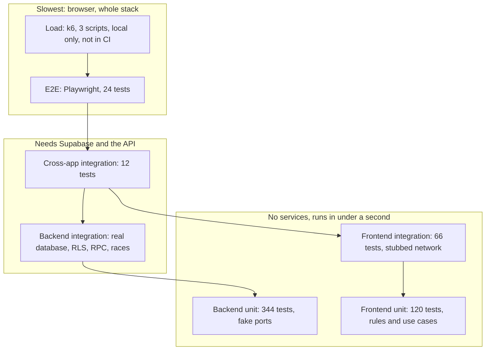

The root `tests/` folder holds the suites that need more than one app: cross-app integration (Vitest), browser e2e
(Playwright) and load tests (k6). This page lists them test by test, then puts every level of the project side by side.
Per-app suites are in the [Frontend test catalog](/test-catalog-frontend) and the [Backend test catalog](/test-catalog-backend);
how and when to run tests is in [Testing](/testing).

## Test pyramid

Counts for the frontend and the backend unit suite were produced by running Vitest; the e2e count by
`npx playwright test --list` in `tests`; the cross-app count by reading the file. The backend integration count and the
per-file detail are in the [Backend test catalog](/test-catalog-backend). E2E, cross-app integration and k6 were not run for
this page (they change data), so their runtime column says so.

| Level | Where | Tests | Needs | Runtime | Command | CI job |
|---|---|---|---|---|---|---|
| Frontend unit | `apps/frontend/tests/unit/` | 120 (12 files) | nothing | under 1 s | `npm run test:unit` in `apps/frontend`, or `task test:unit` | `unit` (Unit tests and build) |
| Frontend integration | `apps/frontend/tests/integration/` | 66 (4 files) | nothing (fake `fetch`) | under 1 s | `npm run test:integration`, or `task test:integration:frontend` | `integration-e2e` |
| Backend unit | `apps/backend/tests/unit/` | 344 (17 files) | nothing | about 1 s | `npm run test:unit` in `apps/backend` | `unit` |
| Backend integration | `apps/backend/tests/integration/` | see the [Backend test catalog](/test-catalog-backend) (8 test files) | local Supabase, seeded, `apps/backend/.env.local` | see the backend catalog | `npm run test:integration` in `apps/backend`, or `task test:integration:backend` | `integration-e2e` |
| Cross-app integration | `tests/integration/` | 12 (1 file) | local Supabase, seeded, the API on 3001 | not measured here | `npm run integration` in `tests`, or `task test:integration:cross` | `integration-e2e` |
| E2E | `tests/e2e/` | 24 (5 files) | Supabase, API on 3001, frontend on 5173, Chromium | not measured here (the slowest level; the browser steps wait on toasts and page loads) | `npm run e2e` in `tests`, or `task test:e2e` | `integration-e2e` |
| Load | `tests/load/` | 3 scripts, no test count (thresholds instead) | the API on 3001, k6 (`brew install k6`) | smoke 20 s, auth about 1 min, booking a few seconds (30 s maximum) | `task test:load` | none: run by hand |

Notes on the CI column (`.github/workflows/ci.yml`):

- Job `unit` runs the frontend unit tests and `npm run build`, then the backend typecheck and unit tests. It needs no services.
- Job `integration-e2e` starts local Supabase on the runner (`supabase start`, `npm run env`, `npm run seed`), then runs in this
  order: frontend integration, backend integration, cross-app integration (with the API started in the background and
  stopped afterwards), Playwright install, e2e, and an upload of `tests/playwright-report/` and `tests/test-results/`. E2E still
  runs when an earlier integration step failed (`!cancelled()` and the backend start succeeded), so each suite reports its own result.
- CI retries failing e2e tests twice (`retries: 2` when `CI` is set) and writes an HTML report; locally there are no retries.
- **k6 load tests are not in CI.** They create load and data on the database and are meant for a local stack only.
- The `docs` job (`fern check`) and the `sonar` job are not test levels; see the CI/CD page.

Read it from the bottom: each level trusts the one below to cover details, so it only checks what the level below cannot
(for example the cross-app suite does not re-test backend rules, only the contract the frontend depends on).

## Which test do I write for what

| I changed or found | Write | Where | Why this level |
|---|---|---|---|
| A pure rule, formatter or error text on the client | frontend unit | `apps/frontend/tests/unit/` | no I/O needed |
| A use case (validation before a request, trimming, conversion) | frontend unit with a fake gateway | `apps/frontend/tests/unit/use-cases/` | assert the gateway log, no network |
| The HTTP client, session store, or a gateway path, method, header, body | frontend integration with `stubNetwork` | `apps/frontend/tests/integration/` | real adaptor, fake network |
| A new import or styling rule for the source tree | extend `layering.test.ts`, `styles.test.ts` or `dark-variants.test.ts` | `apps/frontend/tests/unit/` | scans the tree, runs in CI in a second |
| A business rule, role check or state change in the API | backend unit (fake ports) and, if it depends on the database, backend integration | `apps/backend/tests/` | see the [Backend test catalog](/test-catalog-backend) |
| A race, lock, RLS policy or SQL function | backend integration | `apps/backend/tests/integration/` | only the real database proves it |
| A response field the UI reads, or an error code the UI maps | cross-app integration | `tests/integration/` | real gateways against the real API, parsed with the contract schemas |
| A user journey that crosses pages, roles or a dialog | Playwright e2e | `tests/e2e/<flow>.spec.ts` | the only level that renders the pages |
| A visual or browser behaviour (theme class, reduced motion, keyboard) | Playwright e2e | `tests/e2e/` | needs a real browser; there are no component tests |
| A concurrency claim under many users (one seat, many parents) | k6 script | `tests/load/` | needs real parallel clients; run locally |
| A change to the API contract | update `contract.ts`, run `task docs:openapi`; the contract-alias test and the cross-app suite catch drift | `apps/backend/tests/unit/openapi.test.ts` | the spec and the DTO types must agree |

Rules that apply everywhere: write the failing test first, name tests `<unit> <scenario> <expected>`, no `sleep`, and do not
re-test at a higher level what a lower level proves.

## Cross-app integration

`tests/integration/frontend-backend-contract.test.ts` (12 tests, one `describe`, run in file order).

How it is wired:

| Piece | What it does |
|---|---|
| `tests/vitest.config.ts` | environment `node`; includes `integration/**/*.test.ts`; aliases `@` to `apps/frontend/src` and `@contract` to the backend `contract.ts`; sets `VITE_API_URL` to `http://localhost:3001` (override with `API_URL`); `fileParallelism: false`; `testTimeout` 30 s; loads `integration/local-storage.ts` first |
| `integration/local-storage.ts` | defines `globalThis.localStorage` as an in-memory `Map` with `getItem`, `setItem`, `removeItem`, `clear`, because Node has no usable `localStorage` and the frontend session store needs one |
| `@/app/deps` | the frontend composition root: the tests call the real use cases (`signIn`, `loadMe`, `listCourses`, `bookSeat`, ...), so the real gateways, client middleware and session store run against the live API |
| `e2e/support/env.ts`, `e2e/support/service.ts` | `PASSWORD` and `PNG` (1x1 PNG) fixtures, and `deleteBookings` (service-role cleanup read from `apps/backend/.env.local`) |

Setup (`beforeAll`): sign in as `parent1`, list courses, find the seeded course `คณิตศาสตร์เสริม ม.1` (capacity 20), sign out.
Teardown (`afterAll`): `deleteBookings(created)` with the service key, then `signOut`.

| Test name | What it drives through the frontend gateways | What is validated / expected | Layer |
|---|---|---|---|
| signIn stores the session the client middleware sends | `parentWithoutSeat()`: signs in as `parent3` to `parent10` in turn until one holds no seat in the seeded course (fails if all do) | `currentSession()` has string tokens and a numeric `expiresAt`; `localStorage['seatsure.session']` equals it | adaptor + API |
| loadMe returns the Me shape with the parent role | `GET /me` | `Me.parse` round-trips, role `parent`, email matches `parentN@seatsure.test` | contract |
| listCourses returns approved CourseDto rows including the seeded course | `GET /courses` | at least one row; every row passes `CourseDto.parse` and has `approval_status` `approved`; the seeded course has a free seat | contract |
| bookSeat on a course with spare seats returns a held BookingDto with the joined course | `POST /bookings` with name `  นักเรียนทดสอบ cross  ` | passes `BookingDto.parse`; status `held`, name trimmed, `courses.title` joined, empty `payments` and `payment_proofs`; the id is remembered for cleanup | contract |
| loadMyBookings includes the new booking with its course joined | `GET /bookings/mine` | the booking is listed, parses, and `courses` is `{ title, price }` | contract |
| loadBooking returns the same booking | `GET /bookings/:id` | parses; id and status `held` match | contract |
| submitPaymentProof uploads a PNG File and the booking then lists one proof | `PUT /bookings/:id/proof` with a `File` of the 1x1 PNG, then `loadBooking` | one proof with `booking_id` and a `.png` `proof_path`; status still `held` | adaptor + API |
| confirmPaymentProof marks the booking paid with one payment and a receipt number | `POST /bookings/:id/confirm-payment`, then `loadBooking` | status `paid`, `paid_at` set, one payment `succeeded` with receipt number starting `RC-` | contract |
| loadBooking for an unknown id rejects with DomainError booking_not_found | `GET /bookings/<random uuid>` | the rejection is a `DomainError` with code `booking_not_found` | error mapping |
| loadPaymentSystem as a parent rejects with DomainError forbidden | `GET /admin/payments` as a parent | `DomainError` code `forbidden` | error mapping |
| a garbled access token is refreshed by the middleware and the call still succeeds | overwrites the stored `accessToken` with `garbage.not.a.jwt`, then `loadMe` | the call succeeds; the stored access token changed and the refresh token rotated (the middleware refreshed once and retried) | adaptor + API |
| after signOut the session is gone and calls reject with not_authenticated | `signOut()` (`POST /auth/logout`), then `loadMe` | `currentSession()` is `null`, the storage key is gone, `loadMe` rejects with `not_authenticated` | adaptor + API |

## E2E (Playwright)

Configuration (`tests/playwright.config.ts`): `testDir: 'e2e'`, one `chromium` project (Desktop Chrome), `workers: 1`,
`fullyParallel: false`, `baseURL` `http://localhost:5173`, `trace: 'on-first-retry'`, `retries: 2` only when `CI` is set, an
HTML report in CI, and a `globalSetup`. `webServer` starts the API (`npm start --prefix ../apps/backend`, ready when
`/health` answers) and the frontend (`npm run dev --prefix ../apps/frontend -- --port 5173 --strictPort`), and reuses
them when they already run (`reuseExistingServer: !process.env.CI`).

Real counts from `npx playwright test --list`: 24 tests in 5 files: `auth` 6, `booking-payment` 2, `course-lifecycle` 6,
`login` 1, `theme` 9.

### Support files (`tests/e2e/support/`)

| File | Purpose |
|---|---|
| `env.ts` | `API_URL` (default `http://localhost:3001`), seed `PASSWORD` (`seatsure123`), `backendEnv()` (reads `SUPABASE_URL` and the service role key from `apps/backend/.env.local`, throws when missing), `runId` (unique per test process: time in base 36 plus 4 random characters), `PNG` (1x1 transparent PNG buffer) |
| `api.ts` | arranges data through the real API as real users: `apiLogin`, `schedule(daysAhead)` (starts a week ahead with minutes and seconds set to zero in UTC, one hour long), `createApprovedCourse(title, capacity, price)` (teacher1 creates, admin01 approves, which opens registration), `book`, `bookAndPay` (book, `PUT` proof as raw `image/png`, confirm) |
| `service.ts` | service-role access to PostgREST and Storage over `fetch`: `deleteBookings`, `deleteCourses`, `courseIdsByTitlePrefix`, `cleanupByTitlePrefix`. Deletes in foreign-key order (refund reports, proof rows, payments, bookings; then refund reports by course and courses) and removes the proof images from the `payment-proofs` bucket |
| `ui.ts` | `signInWithForm(page, email, password)` (fills the labels `อีเมล` and `รหัสผ่าน`, clicks the button `เข้าสู่ระบบ`), `signInAsDemo(page, label)` (a demo-account button, dev server only, then waits for `ออกจากระบบ`), `courseHeading(page, title)`, `localDateTime(date)` (value for a `datetime-local` input), `SESSION_KEY` |
| `global-setup.ts` | runs `cleanupByTitlePrefix('E2E ')` before any spec: removes every `E2E ` course (with bookings, payments, proofs, refunds) that an interrupted run left behind |

Courses made by a spec are titled `E2E <runId> ...`; every spec that creates data deletes it in `afterAll` with
`cleanupByTitlePrefix('E2E <runId>')`.

### `login.spec.ts` (1 test)

| Test | Arranged data | Browser steps | Locators | Asserted |
|---|---|---|---|---|
| login page shows the sign-in form to a visitor | none | open `/` | role heading `เข้าสู่ระบบ`; CSS `input[type=email]`, `input[type=password]` | the heading and both inputs are visible |

### `auth.spec.ts` (6 tests)

No data is created. The tests use the seeded `parent1` and the seeded course `คณิตศาสตร์เสริม ม.1`.

| Test | Browser steps | Locators | Asserted |
|---|---|---|---|
| parent sign-in lands on the course list | `signInAsDemo` with button `ผู้ปกครอง 1` | heading `คอร์สเรียนเสริม`, `courseHeading` of the seeded course | both visible |
| wrong password shows the Thai error and stays on the login page | `signInWithForm` with `parent1@seatsure.test` and `wrong-password` | text `อีเมลหรือรหัสผ่านไม่ถูกต้อง`, heading `เข้าสู่ระบบ` | error visible, still on login, `localStorage['seatsure.session']` is `null` |
| logout returns to the login page and forgets the session | sign in by form, wait for the course list, click `ออกจากระบบ` | button `ออกจากระบบ`, heading `เข้าสู่ระบบ` | login page shown, session key is `null` |
| a protected route while signed out shows the login page | open `/bookings` with no session | heading `เข้าสู่ระบบ` | login shown and the URL is `/` |
| a garbled access token is refreshed silently and the page still loads data after a reload | sign in as demo `ผู้ปกครอง 1`; in the page, set the stored `accessToken` to `garbage.not.a.jwt`; reload | headings, polling on the stored token | list and seeded course visible; the stored access token is eventually not the garbage value |
| garbled access and refresh tokens sign the user out | set both tokens to garbage; reload | heading `เข้าสู่ระบบ` | login shown; the stored session becomes `null` |

### `booking-payment.spec.ts` (2 tests, serial)

Arranged in `beforeAll` through the API: `createApprovedCourse('E2E <runId> คอร์สจองและชำระเงิน', 2)` (teacher1 creates, admin01
approves). `afterAll`: `cleanupByTitlePrefix`.

| Test | Browser steps | Locators | Asserted |
|---|---|---|---|
| parent books from the course list, attaches a proof, confirms and opens the receipt | `ผู้ปกครอง 2`: on the course card click `ลงทะเบียน`, fill `ชื่อผู้เรียน` with `น้องทดสอบ อีทูอี`, click `ยืนยันการจอง`; on `/bookings` attach `proof.png` (`image/png`) through the label `แนบรูปหลักฐานการโอน`; click `ยืนยันการชำระเงิน`; click link `ดูใบเสร็จ` | `listitem` filtered by the course heading, `dialog`, `getByLabel`, `getByRole('button')`, `getByText` | card shows `เหลือ 2 จาก 2 ที่นั่ง`; after booking the URL ends `/bookings`, status `รอชำระเงิน` and the student name show; after the upload the toast `บันทึกหลักฐานแล้ว กรุณากดยืนยันการชำระเงิน` and the note `แนบหลักฐานแล้ว ยังไม่ได้ยืนยันการชำระเงิน`; after confirm the toast `ยืนยันการชำระเงินแล้ว` and status `ชำระแล้ว`; the receipt page (URL `/receipt/`) has heading `ใบยืนยันการจองและใบเสร็จรับเงิน`, a number matching `RC-` plus 8 digits, a dash and 6 digits, the text `ชำระแล้ว ยืนยันที่นั่งแล้ว` and the course title |
| a parent who confirms after the last seat went sees the full message | `ผู้ปกครอง 3` opens the booking dialog (card shows `เหลือ 1 จาก 2 ที่นั่ง`); meanwhile `parent4` books the last seat through the API (`apiLogin`, `book`); parent 3 fills `น้องมาช้า` and clicks `ยืนยันการจอง`; then clicks `ยกเลิก` | dialog, card | the dialog shows `คอร์สนี้เต็มแล้ว`; the URL stays `/`; after closing the dialog the card shows `เต็มแล้ว` (the list reloaded) |

### `course-lifecycle.spec.ts` (6 tests, serial)

`afterAll`: `cleanupByTitlePrefix('E2E <runId>')`. Two titles: `... คอร์สที่ครูส่ง` (made through the UI) and `... คอร์สที่จะยกเลิก` (made through the API).

| Test | Arranged data and browser steps | Locators | Asserted |
|---|---|---|---|
| teacher submits a course through the form and it waits for approval | demo `ครู`; click `เพิ่มคอร์ส`; fill `ชื่อคอร์ส`, `รายละเอียด`, `เริ่มวันที่และเวลา` (14 days ahead, 09:00 local), `สิ้นสุดวันที่และเวลา` (+2 h), `จำนวนรับ (คน)` 5, `ราคา (บาท)` 1200; click `เพิ่มคอร์ส` in the dialog | heading `รายชื่อผู้เรียน`, dialog labels | toast `ส่งคอร์สให้แอดมินโรงเรียนอนุมัติแล้ว`, dialog closes, course heading visible, a counter text matching `N คอร์สรอแอดมินอนุมัติ` with N at least 1 |
| a pending course is not shown to parents | demo `ผู้ปกครอง 1` | `courseHeading` | seeded course visible; the pending course count is 0 |
| admin (not admin01) is not shown the approval queue | demo `แอดมิน` (`admin@seatsure.test`) | heading `จัดการคอร์ส`, row with the seeded course, heading `คอร์สรออนุมัติจากครู`, button `อนุมัติ <title>` | the queue heading and the approve button do not exist (count 0) |
| admin01 approves the course from the queue | `signInWithForm` as `admin01@seatsure.test`; click the button `อนุมัติ <title>` | heading `คอร์สรออนุมัติจากครู` | toast `อนุมัติคอร์สแล้ว`; the approve button is gone |
| the approved course is then shown to parents | demo `ผู้ปกครอง 1` | card by heading, button `ลงทะเบียน` | card and its register button are visible |
| admin cancels a course with a paid booking and sees one refund | API: `createApprovedCourse(toCancel, 3)`, `parent5` logs in and `bookAndPay`; UI: demo `แอดมิน`, in the course row click `ยกเลิกคอร์ส`, fill `เหตุผลที่ยกเลิก` with `ครูติดภารกิจ (e2e)`, click `ยืนยันยกเลิกคอร์ส` | row filtered by title, dialog | toast `เพิ่มรายการคืนเงิน 1 รายการ`; the row shows `ยกเลิกแล้ว` |

### `theme.spec.ts` (9 tests)

No API data (the global setup still runs). `beforeEach`: emulate colour scheme `light`, open `/`, clear `localStorage`, reload.
The toggle is the button `เปลี่ยนธีม`; choices are menu items `สว่าง`, `มืด`, `ตามระบบ`.

| Test | Browser steps | Asserted |
|---|---|---|
| the toggle on the login page switches to dark and back | choose `มืด`, then `สว่าง` | `html` gets the `dark` class, then loses it |
| the choice survives a reload without a flash of the wrong theme | choose `มืด`, reload | class `dark` is present, the toggle is visible, `localStorage['seatsure-theme']` is `dark` |
| the class is already set before the app loads | set `seatsure-theme` to `dark`, abort requests to `**/src/main.tsx*`, reload | `html` has `dark` while `#root` is empty: only the inline script in `index.html` can have set it |
| system follows the operating system, live | choose `ตามระบบ`, then emulate dark, then light | `dark` class follows each change |
| an explicit choice ignores the operating system | choose `สว่าง`, emulate dark | no `dark` class |
| native controls follow the theme through color-scheme | choose `มืด` | `html` CSS `color-scheme` is `dark` |
| works from the keyboard | focus the toggle, `Enter`, check focus on `สว่าง`, `ArrowDown` to `มืด`, `Enter` | focus moves as expected and the `dark` class is set |
| has no running transition when the visitor prefers reduced motion | emulate `reducedMotion: reduce` | toggle `transition-duration` is `0s` |
| keeps the transition for everyone else | emulate `no-preference` | toggle `transition-duration` is not `0s` |

## Load tests (k6)

Scripts in `tests/load/`, run by `task test:load` (`smoke.js`, `auth.js`, `booking.js` in that order; the task stops with a
hint when `k6` is not installed). Not part of CI. Run the API with `npm start` (no file watcher) so a restart does not
look like connection errors.

### `config.js` (shared)

| Piece | Behaviour |
|---|---|
| `BASE_URL` | `BASE_URL` env, default `http://localhost:3001` |
| **Localhost guard** | the URL must match `http(s)://localhost` or `127.0.0.1` (optional port); otherwise the script aborts with `Refusing to load test <url>` unless `ALLOW_REMOTE=1` is set |
| `PASSWORD`, `parentEmail(n)` | `SEED_PASSWORD` env or `seatsure123`; `parent1` to `parent10`, wrapping around (`((n - 1) % 10) + 1`) |
| `login(email)` | `POST /auth/login`; checks `login 200` and `login envelope has a session`; returns the session or `null` |
| `isEnvelope(res)` | true when the body is `{ success: true, data }` or `{ success: false, message }` |

### Scripts

| Script | Load | Flow | Thresholds | Checks | Data created |
|---|---|---|---|---|---|
| `smoke.js` | 1 VU for 20 s | `GET /health`; login as `parent1`; `GET /me`; `GET /me` without a token (expects 401, declared as an expected status); `sleep(1)` | `http_req_failed` rate under 1 %, `http_req_duration` p95 under 500 ms, `checks` rate over 99 % | `health 200`, `health envelope`, `me 200`, `me is a parent`, `me without token is 401`, `401 envelope` | none (only sessions) |
| `auth.js` | ramp 0 to 10 VUs in 15 s, 10 to 25 in 30 s, 25 to 0 in 15 s | each VU logs in as `parentN` (N from the VU number); `GET /me`; `POST /auth/refresh` with the refresh token; `sleep(1)` (also after a failed login, to avoid a tight retry loop) | `http_req_failed` under 1 %; p95 of `POST /auth/login` under 800 ms, of `GET /me` under 400 ms, of `POST /auth/refresh` under 800 ms; `checks` over 99 % | `login 200`, `login envelope has a session`, `me 200`, `refresh 200` | none (only sessions) |
| `booking.js` | scenario `last_seat`: 10 VUs, 1 iteration each (`per-vu-iterations`), 30 s maximum | see below | `booking_successes` count 1, `booking_course_full` count 9, `booking_unexpected` count 0, `booking_seats_held_after_run` count 1, `http_req_failed` rate 0, `checks` rate 1 | `booking uses the envelope`, `booking is 201 or 400 course_full`, `no 5xx`, plus `exactly one seat is held after the run` and `teardown cancels the course` | one course `K6 <ISO time> last seat`, one held booking, the course is cancelled in teardown |

`booking.js` flow:

1. `setup()`: sign in `teacher1` and `admin01` (aborts if either fails); teacher1 creates a capacity-1, price-100 course a week
   ahead (`POST /courses`); admin01 approves it (`POST /courses/:id/approval`); `parent1` to `parent10` sign in up front, so the
   virtual users only send the booking.
2. Default function, per VU: `POST /bookings` with `k6 VU <n>` as the student name, status 201 and 400 declared expected.
   A 201 adds to `booking_successes`; a 400 with `{ success: false, message: 'course_full' }` adds to `booking_course_full`;
   anything else adds to `booking_unexpected`.
3. `teardown()`: sign in `admin@seatsure.test`, read `GET /courses/:id/roster` and count rows with status `held` into
   `booking_seats_held_after_run` (the database must show one seat, not only the responses); then `POST /courses/:id/cancel`
   with the reason `k6 contention run`, so the course leaves the parents' list.

## Test data and cleanup

All suites run against the seeded local database (`npm run seed` in `apps/backend`, password `seatsure123`).

| Seed account | Role | Used by |
|---|---|---|
| `admin@seatsure.test` | admin | e2e (cancel course, not admin01), k6 teardown |
| `admin01@seatsure.test` | admin, the school admin | e2e and k6 (approves courses), e2e approval queue |
| `teacher1@seatsure.test` | teacher | e2e and k6 (creates courses) |
| `parent1@seatsure.test` | parent | e2e auth and lifecycle, cross-app setup, k6 smoke |
| `parent2` to `parent5` | parent | e2e: `parent2` books and pays, `parent3` and `parent4` race for the last seat, `parent5` pays before the cancellation |
| `parent3` to `parent10` | parent | cross-app: the first without a seat in the seeded course books |
| `parent1` to `parent10` | parent | k6 `auth.js` and `booking.js` |
| seeded courses `คณิตศาสตร์เสริม ม.1` (capacity 20), `ภาษาอังกฤษสนทนา` (15), `ฟิสิกส์โอลิมปิก` (2) | n/a | read by e2e auth and lifecycle and by the cross-app suite (math course) |

| Suite | Data it creates | Run id or title | Who deletes it | Known leftovers |
|---|---|---|---|---|
| Frontend unit and integration | none (fake `fetch`, in-memory storage) | n/a | n/a | none |
| Backend integration | its own users, courses, bookings | `Test course <runId>-NN`, `API test ...`, `Test parent NN` | the suite's `cleanup()` in `apps/backend/tests/integration/helpers.ts` (deletes refund reports first and throws on a failed step since commit `e126d56`) | earlier runs, before that fix, left `Test course ...` rows, held bookings and `Test parent NN` profiles; see the backend catalog |
| Cross-app integration | one held then paid booking on the seeded math course, one proof image, one payment and receipt | no title; the booking id is collected in `created` | `afterAll`: `deleteBookings` with the service key (refund reports, proofs and their images, payments, bookings) | none expected; an interrupted run leaves that one booking (a parent keeps a seat in the seeded course, which the next run skips over) |
| E2E | courses made through the API or the UI, their bookings, proof images, payments, refund reports; a refund report is created by the cancel test | `E2E <runId> ...` | each spec's `afterAll` calls `cleanupByTitlePrefix('E2E <runId>')`; `global-setup.ts` removes every `E2E ` course before the next run | none after a clean run; an interrupted run leaves `E2E ` rows until the next global setup |
| k6 `smoke.js`, `auth.js` | sessions only | n/a | n/a | none |
| k6 `booking.js` | one course, one held booking | `K6 <ISO time> last seat`, student `k6 VU <n>` | the script cancels the course in teardown but cannot delete rows (no service key in k6) | **every run leaves one cancelled `K6 ...` course with its held booking**; it is visible to admins in the course table. Nothing removes them automatically; delete by title prefix `K6 ` with the service key, or `task backend:reset` |

Cleanup rules: arrange data through the API as the real users would, use the service key only for cleanup, never in the
browser; give every created row a title or name carrying a prefix and a run id so a failed run can be swept by prefix.
